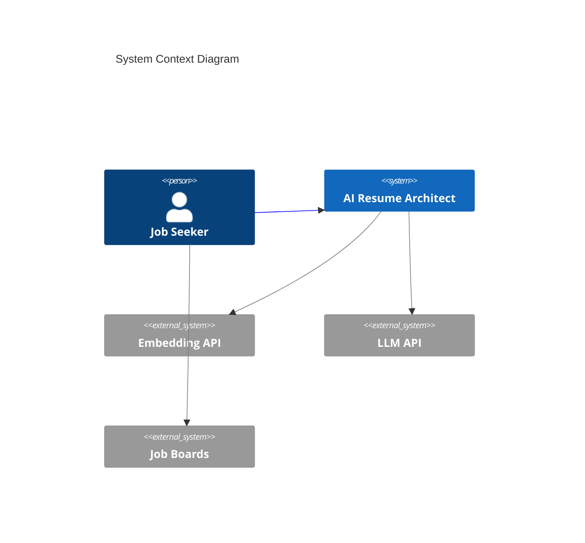
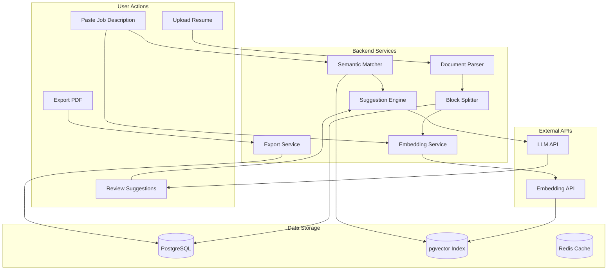
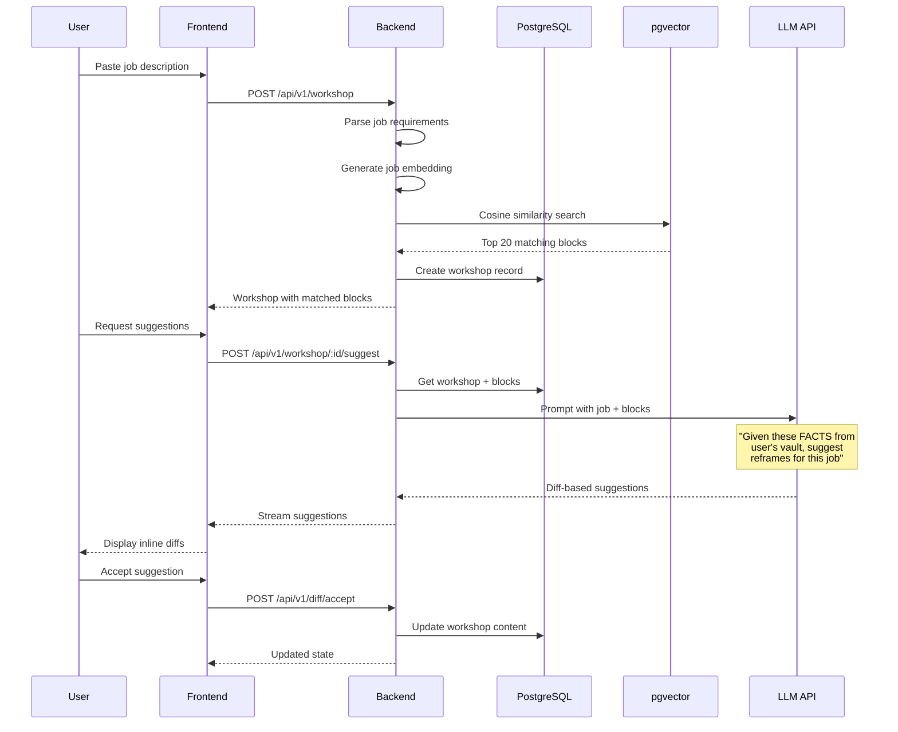
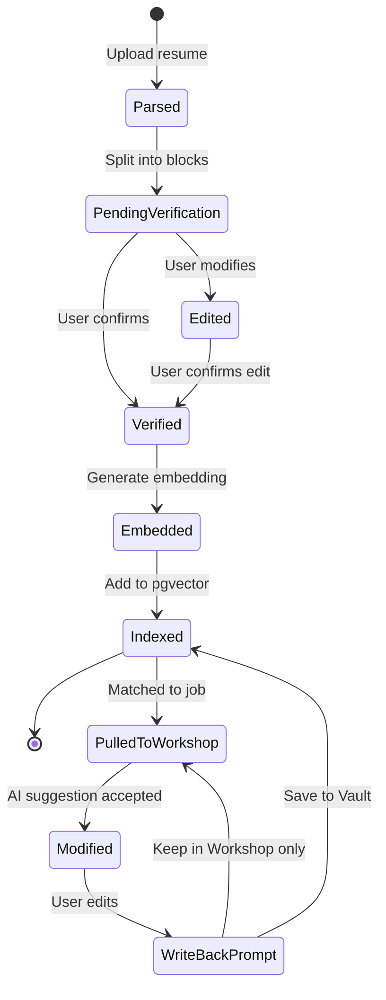

# PROJECT MASTER PLAN: AI Resume Architect

> **Single Source of Truth** for the AI Resume Architect platform.
> Philosophy: From "Generative Slop" to "Precision Engineering"

---

## Table of Contents

1. [Executive Summary](#executive-summary)
2. [Product Vision: The Vault & Workshop Model](#product-vision-the-vault--workshop-model)
3. [Four Strategic Lenses](#four-strategic-lenses)
4. [Data Architecture](#data-architecture)
5. [User Journey](#user-journey)
6. [Technical Diagrams](#technical-diagrams)
7. [Implementation Roadmap](#implementation-roadmap)
8. [Success Metrics](#success-metrics)
9. [Appendix](#appendix)
   - [A. Glossary](#a-glossary)
   - [B. Related Documents](#b-related-documents)
   - [C. Decision Log](#c-decision-log)
   - [D. ATS Compatibility: Honest Scope](#d-ats-compatibility-honest-scope)

---

## Executive Summary

### The Problem with Current AI Resume Tools

Most AI resume builders suffer from **"Generative Slop"**:
- AI invents accomplishments the user never achieved
- Metrics appear from nowhere ("increased sales by 47%")
- Generic bullet points that could apply to anyone
- Users lose control over their own narrative

### Our Philosophy: Precision Engineering

**The AI Resume Architect operates on one fundamental principle:**

> **The AI can ONLY use facts that exist in the user's Vault.**
> It cannot hallucinate. It cannot invent. It can only retrieve, reframe, and recommend.

This transforms the AI from an unreliable content generator into a **precision retrieval and optimization engine**.

### Current State vs. Target Architecture

| Aspect | Current Implementation | Target Architecture |
|--------|----------------------|---------------------|
| Resume Storage | Monolithic JSON blob in `parsed_content` | Atomic Experience Blocks with embeddings |
| AI Approach | Full rewrite/generation | Diff-based, line-by-line suggestions |
| Retrieval | None (AI sees full resume) | RAG with pgvector semantic search |
| User Control | Accept full AI output | Accept/reject individual edits |
| Fact Source | AI can hallucinate | Only facts from user's Vault |
| Personalization | Generic suggestions | Semantic matching to job requirements |

---

## Product Vision: The Vault & Workshop Model

### Mental Model

```
┌─────────────────────────────────────────────────────────────────┐
│                        USER'S UNIVERSE                          │
│                                                                 │
│  ┌─────────────────────┐         ┌─────────────────────┐        │
│  │                     │         │                     │        │
│  │       VAULT         │ ──────► │      WORKSHOP       │        │
│  │                     │         │                     │        │
│  │  • All experiences  │ Pull    │  • Active resume    │        │
│  │  • Every fact       │ blocks  │  • Job-specific     │        │
│  │  • Verified truths  │         │  • In-progress      │        │
│  │  • Immutable source │         │  • Editable draft   │        │
│  │                     │         │                     │        │
│  └─────────────────────┘         └─────────────────────┘        │
│            ▲                              │                     │
│            │                              │                     │
│            └──────────────────────────────┘                     │
│                    Write-back loop                              │
│              (new facts → Vault)                                │
└─────────────────────────────────────────────────────────────────┘
```

### The Vault (Source of Truth)

The Vault is the user's **permanent repository of career facts**:

- **Immutable History**: Every job, project, achievement stored as atomic blocks
- **Verified Content**: User confirms accuracy before facts enter the Vault
- **Searchable**: Vector embeddings enable semantic retrieval
- **Growing**: New experiences added over time, never deleted

### The Workshop (Active Workspace)

The Workshop is where **tailored resumes are crafted**:

- **Job-Specific**: Each workshop instance targets one job posting
- **AI-Assisted**: Suggestions pulled from Vault, never invented
- **Diff-Based**: Line-by-line suggestions, user accepts/rejects each
- **Exportable**: Final output as PDF, DOCX, or JSON

### The Write-Back Loop

When users edit content in the Workshop:

```
User edits bullet in Workshop
         │
         ▼
    ┌─────────────┐
    │ "Save to    │
    │  Vault?"    │
    └─────────────┘
         │
    ┌────┴────┐
    ▼         ▼
  [Yes]     [No]
    │         │
    ▼         │
Create new    │
block OR      │
update        │
existing      │
    │         │
    ▼         │
Re-embed      │
    │         │
    └────┬────┘
         ▼
   Continue editing
```

---

## Four Strategic Lenses

### Lens 1: Product Management

#### User Problems We Solve

| Problem                           | Solution                                                                                   |
| --------------------------------- | ------------------------------------------------------------------------------------------ |
| "AI writes things I never did"    | Vault-only retrieval, no hallucination                                                     |
| "I lose my authentic voice"       | AI suggests, user decides, user can talk to the AI with chatbot to suggest tone or changes |
| "Generic bullets that fit anyone" | Semantic matching to job requirements                                                      |
| "Starting from scratch each time" | Vault persists across all applications                                                     |
| "Don't know what to include"      | AI recommends based on job analysis                                                        |

#### User Personas

**Primary: The Intentional Job Seeker**
- Applies to 5-15 jobs per search
- Values quality over speed
- Wants control over their narrative
- Frustrated by generic AI output

**Secondary: The Career Documenter**
- Updates resume quarterly
- Tracks achievements in real-time
- Wants a "career journal" that compounds

#### Feature Priority Matrix

| Feature | Impact | Effort | Priority |
|---------|--------|--------|----------|
| Atomic Experience Blocks | High | High | P0 |
| Semantic Job Matching | High | Medium | P0 |
| Diff-Based Suggestions | High | Medium | P1 |
| Write-Back Loop | Medium | Low | P1 |
| Multi-Format Export | Medium | Low | P2 |
| ATS Compatibility Checks | Medium | Medium | P2 |

### Lens 2: Engineering

#### System Architecture

```
┌─────────────────────────────────────────────────────────────────────┐
│                           FRONTEND (Next.js)                        │
│  ┌──────────────┐  ┌──────────────┐  ┌──────────────┐               │
│  │ Vault View   │  │ Workshop     │  │ Job Analyzer │               │
│  │ (list/edit)  │  │ (diff editor)│  │ (paste/parse)│               │
│  └──────────────┘  └──────────────┘  └──────────────┘               │
└────────────────────────────┬────────────────────────────────────────┘
                             │ REST/WebSocket
                             ▼
┌─────────────────────────────────────────────────────────────────────┐
│                           BACKEND (FastAPI)                         │
│  ┌──────────────┐  ┌──────────────┐  ┌──────────────┐               │
│  │ Block CRUD   │  │ RAG Pipeline │  │ Diff Engine  │               │
│  │ /blocks/*    │  │ /match/*     │  │ /suggest/*   │               │
│  └──────────────┘  └──────────────┘  └──────────────┘               │
└──────────┬─────────────────┬─────────────────┬──────────────────────┘
           │                 │                 │
           ▼                 ▼                 ▼
┌──────────────────┐ ┌──────────────────┐ ┌──────────────────┐
│   PostgreSQL     │ │     pgvector     │ │      Redis       │
│   (blocks, users)│ │   (embeddings)   │ │   (sessions)     │
└──────────────────┘ └──────────────────┘ └──────────────────┘
                             │
                             ▼
                    ┌──────────────────┐
                    │  Embedding API   │
                    │ (OpenAI/Gemini)  │
                    └──────────────────┘
```

#### Key Technical Decisions

| Decision | Choice | Rationale |
|----------|--------|-----------|
| Vector Store | pgvector + HNSW | Single DB, O(log n) ANN queries, transactional with blocks |
| Embedding Model | Gemini text-embedding-004 | 768 native dimensions, task_type support for asymmetric retrieval |
| Index Type | HNSW (m=16, ef_construction=64) | Better recall than IVFFlat, no training required, consistent performance |
| Diff Format | JSON Patch (RFC 6902) | Standardized, reversible |
| Real-time | WebSocket | Streaming suggestions |
| Export | WeasyPrint | Pure Python, no external deps |

#### API Endpoints (Target State)

```
# Vault Operations
POST   /api/v1/blocks              # Create experience block
GET    /api/v1/blocks              # List all blocks (paginated)
GET    /api/v1/blocks/:id          # Get single block
PATCH  /api/v1/blocks/:id          # Update block
DELETE /api/v1/blocks/:id          # Soft delete block

# Retrieval & Matching
POST   /api/v1/match               # Semantic search against job
GET    /api/v1/match/:job_id       # Get cached matches

# Workshop Operations
POST   /api/v1/workshop            # Create workshop for job
GET    /api/v1/workshop/:id        # Get workshop state
POST   /api/v1/workshop/:id/pull   # Pull blocks into workshop
POST   /api/v1/workshop/:id/suggest# Get AI suggestions (streaming)

# Diff Operations
POST   /api/v1/diff/accept         # Accept suggestion
POST   /api/v1/diff/reject         # Reject suggestion
POST   /api/v1/diff/writeback      # Save edit to Vault

# Export
POST   /api/v1/export/pdf          # Export workshop as PDF
POST   /api/v1/export/docx         # Export workshop as DOCX
```

### Lens 3: Business

#### Revenue Model Options

| Model | Description | Pros | Cons |
|-------|-------------|------|------|
| Freemium + Export | Free Vault, pay for PDF/DOCX | Low friction | Limited conversion |
| Usage-Based | Pay per AI suggestion batch | Aligned with value | Unpredictable |
| Subscription | Monthly access to all features | Predictable revenue | Higher churn |
| **Hybrid (Recommended)** | Free Vault, subscription for Workshop | Best of both | Complexity |

#### Competitive Differentiation

| Competitor | Approach | Our Advantage |
|------------|----------|---------------|
| Generic AI tools | Full generation | No hallucination, user control |
| Traditional builders | Templates | AI-powered matching |
| ATS optimizers | Keyword stuffing | Semantic understanding |

#### Key Metrics

- **Activation**: User creates 5+ blocks in Vault
- **Retention**: Weekly active Workshop sessions
- **Conversion**: Free → Paid on export attempt
- **NPS**: "Would you recommend to a job-seeking friend?"

### Lens 4: Security

#### Data Classification

| Data Type | Classification | Storage | Access |
|-----------|---------------|---------|--------|
| User credentials | Critical | Hashed (bcrypt) | Auth only |
| Experience blocks | Sensitive | Encrypted at rest | User only |
| Embeddings | Internal | Plain (no PII) | System |
| Job postings | Public | Plain | System |

#### PII Handling Pipeline

```
┌──────────────────────────────────────────────────────────────┐
│                    PII STRIPPING PIPELINE                    │
│                                                              │
│  Raw Block ──► Strip PII ──► Generate Embedding ──► Store    │
│                                                              │
│  PII Stripped:                                               │
│  • Name → [NAME]                                             │
│  • Email → [EMAIL]                                           │
│  • Phone → [PHONE]                                           │
│  • Address → [ADDRESS]                                       │
│  • SSN/ID → [REDACTED]                                       │
│                                                              │
│  Embedding NEVER sees real PII                               │
└──────────────────────────────────────────────────────────────┘
```

#### Security Requirements

| Requirement           | Implementation                      |
| --------------------- | ----------------------------------- |
| Authentication        | JWT with refresh tokens             |
| Authorization         | Row-level security in PostgreSQL    |
| Encryption at Rest    | PostgreSQL TDE or application-level |
| Encryption in Transit | TLS 1.3 everywhere                  |
| Rate Limiting         | Redis-based, per-user               |
| Audit Logging         | All CRUD operations logged          |
| Data Portability      | Full export in JSON format          |
| Right to Deletion     | Hard delete with cascade            |

#### Threat Model

| Threat | Mitigation |
|--------|------------|
| Embedding inversion attacks | PII stripped before embedding |
| Unauthorized block access | Row-level security, user_id checks |
| AI prompt injection | Structured prompts, input validation |
| Data exfiltration | Rate limiting, anomaly detection |
| Session hijacking | Secure cookies, short JWT expiry |

---

## Data Architecture

### Experience Block Schema

```python
class ExperienceBlock(Base):
    """
    Optimized for Google Gemini text-embedding-004 (768 dimensions).

    IMPORTANT - Gemini Task Types for Asymmetric Retrieval:
    - RETRIEVAL_DOCUMENT: Use when SAVING/INGESTING blocks
    - RETRIEVAL_QUERY: Use when SEARCHING/MATCHING against jobs

    Failure to separate task types degrades retrieval quality!
    See: backend/app/services/embedding.py
    """
    __tablename__ = "experience_blocks"

    # Identity
    id = Column(Integer, primary_key=True, index=True)
    user_id = Column(Integer, ForeignKey("users.id"), nullable=False)

    # Content
    content = Column(Text, nullable=False)
    block_type = Column(String(50), nullable=False)  # achievement, responsibility, skill, etc.

    # Taxonomy
    tags = Column(ARRAY(String), default=list)  # ["python", "leadership", "backend"]

    # Provenance
    source_company = Column(String(255))
    source_role = Column(String(255))
    source_date_start = Column(Date)
    source_date_end = Column(Date)  # NULL = current

    # Embeddings (pgvector) - Gemini text-embedding-004 native output
    embedding = Column(Vector(768))  # 768 = Gemini native (NOT 1536 OpenAI)
    embedding_model = Column(String(100), default="text-embedding-004")

    # Lazy Update Support - SHA-256 hash prevents redundant re-embedding
    content_hash = Column(String(64))  # Compare before burning API credits

    # Verification
    verified = Column(Boolean, default=False)
    verification_date = Column(DateTime)

    # Metadata
    created_at = Column(DateTime, server_default=func.now())
    updated_at = Column(DateTime, onupdate=func.now())
    deleted_at = Column(DateTime)  # Soft delete

    # Indexes - HNSW for O(log n) ANN queries
    __table_args__ = (
        Index("ix_blocks_user_id", "user_id"),
        # HNSW: m=16 connections, ef_construction=64 build quality
        Index(
            "ix_blocks_embedding_hnsw",
            "embedding",
            postgresql_using="hnsw",
            postgresql_with={"m": 16, "ef_construction": 64},
            postgresql_ops={"embedding": "vector_cosine_ops"},
        ),
        Index("ix_blocks_tags", "tags", postgresql_using="gin"),
        Index("ix_blocks_user_type", "user_id", "block_type"),
    )

    def check_needs_reembedding(self, new_content: str) -> bool:
        """Compare hashes to avoid re-embedding unchanged content."""
        if self.embedding is None or self.content_hash is None:
            return True
        new_hash = hashlib.sha256(new_content.encode()).hexdigest()
        return new_hash != self.content_hash

    @classmethod
    async def search_experience(
        cls,
        db: AsyncSession,
        query_vector: List[float],  # MUST use task_type="RETRIEVAL_QUERY"
        user_id: int,
        limit: int = 20,
        block_types: List[str] = None,
        tags: List[str] = None,
    ) -> List["ExperienceBlock"]:
        """
        Hybrid semantic search with FILTER-FIRST optimization.

        CRITICAL: SQL filters (user_id, tags, types) applied BEFORE
        vector distance to minimize compute costs.
        """
        conditions = [
            cls.user_id == user_id,
            cls.deleted_at.is_(None),
            cls.embedding.isnot(None),
        ]
        if block_types:
            conditions.append(cls.block_type.in_(block_types))
        if tags:
            conditions.append(cls.tags.contains(tags))

        stmt = (
            select(cls)
            .where(and_(*conditions))
            .order_by(cls.embedding.cosine_distance(query_vector))
            .limit(limit)
        )
        result = await db.execute(stmt)
        return list(result.scalars().all())
```

### JSON Representation

```json
{
  "id": 1,
  "user_id": 42,
  "content": "Built Redis caching layer reducing API latency by 40% and cutting infrastructure costs by $2,000/month",
  "block_type": "achievement",
  "tags": ["redis", "performance", "backend", "cost-optimization"],
  "source": {
    "company": "TechCorp Inc.",
    "role": "Senior Backend Engineer",
    "date_start": "2022-03-01",
    "date_end": "2024-01-15"
  },
  "embedding": [0.0123, -0.0456, 0.0789, ...],  // 768 dimensions (Gemini native)
  "embedding_model": "text-embedding-004",
  "content_hash": "a3f2b8c1...",  // SHA-256 for lazy updates
  "verified": true,
  "verification_date": "2024-01-20T10:30:00Z",
  "created_at": "2024-01-15T08:00:00Z",
  "updated_at": "2024-01-20T10:30:00Z"
}
```

### Block Types Taxonomy

| Type | Description | Example |
|------|-------------|---------|
| `achievement` | Quantified accomplishment | "Increased test coverage from 45% to 92%" |
| `responsibility` | Ongoing duty | "Managed team of 5 engineers" |
| `skill` | Technical/soft skill | "Python, FastAPI, PostgreSQL" |
| `project` | Discrete project | "Led migration from monolith to microservices" |
| `certification` | Credential | "AWS Solutions Architect Professional" |
| `education` | Degree/course | "M.S. Computer Science, Stanford" |

### Workshop Schema

```python
class Workshop(Base):
    __tablename__ = "workshops"

    id = Column(Integer, primary_key=True, index=True)
    user_id = Column(Integer, ForeignKey("users.id"), nullable=False)

    # Target job
    job_title = Column(String(255))
    job_company = Column(String(255))
    job_description = Column(Text)  # Raw JD text
    job_embedding = Column(Vector(768))  # Gemini 768 dims (use RETRIEVAL_QUERY)

    # State
    status = Column(String(50), default="draft")  # draft, in_progress, exported

    # Content (current state of tailored resume)
    sections = Column(JSONB)  # Structured resume content

    # Pulled blocks (references to Vault)
    pulled_block_ids = Column(ARRAY(Integer))

    # Pending suggestions
    pending_diffs = Column(JSONB)  # JSON Patch operations

    # History
    created_at = Column(DateTime, server_default=func.now())
    updated_at = Column(DateTime, onupdate=func.now())
    exported_at = Column(DateTime)
```

### Migration from Current Schema

```sql
-- Current: Monolithic parsed_content JSON
-- Target: Atomic experience_blocks table with Gemini-optimized pgvector

-- Step 1: Enable pgvector extension
CREATE EXTENSION IF NOT EXISTS vector;

-- Step 2: Create experience_blocks table
CREATE TABLE experience_blocks (
    id SERIAL PRIMARY KEY,
    user_id INTEGER NOT NULL REFERENCES users(id),
    content TEXT NOT NULL,
    block_type VARCHAR(50) NOT NULL,
    tags TEXT[] DEFAULT '{}',
    source_company VARCHAR(255),
    source_role VARCHAR(255),
    source_date_start DATE,
    source_date_end DATE,
    -- Gemini text-embedding-004: 768 native dimensions (NOT 1536 OpenAI)
    embedding vector(768),
    embedding_model VARCHAR(100) DEFAULT 'text-embedding-004',
    -- Content hash for lazy updates (don't re-embed unchanged content)
    content_hash VARCHAR(64),
    verified BOOLEAN DEFAULT FALSE,
    verification_date TIMESTAMPTZ,
    created_at TIMESTAMPTZ DEFAULT NOW(),
    updated_at TIMESTAMPTZ,
    deleted_at TIMESTAMPTZ
);

-- Step 3: Create indexes (HNSW for O(log n) ANN queries)
CREATE INDEX ix_blocks_user_id ON experience_blocks(user_id);

-- HNSW index: m=16 connections per node, ef_construction=64 build quality
-- HNSW advantages over IVFFlat:
--   - No training required (works immediately)
--   - Better recall at same query speed
--   - Consistent performance regardless of data distribution
CREATE INDEX ix_blocks_embedding_hnsw ON experience_blocks
    USING hnsw (embedding vector_cosine_ops)
    WITH (m = 16, ef_construction = 64);

-- GIN index for efficient tag filtering (filter-first optimization)
CREATE INDEX ix_blocks_tags ON experience_blocks USING gin(tags);

-- Composite index for common filter patterns
CREATE INDEX ix_blocks_user_type ON experience_blocks(user_id, block_type);

-- Step 4: Migration script (Python)
-- Parse existing parsed_content JSON
-- Extract individual bullet points
-- Classify block types
-- Generate embeddings with task_type="RETRIEVAL_DOCUMENT"
-- Compute content_hash for each block
-- Insert as atomic blocks

-- Step 5: Keep parsed_content for rollback (30 days)
-- Step 6: Drop parsed_content column after validation
```

---

## User Journey

### Journey 1: Vault Ingestion

```
┌─────────────────────────────────────────────────────────────────────┐
│                      VAULT INGESTION FLOW                           │
│                                                                     │
│  ┌──────────┐    ┌──────────┐    ┌──────────┐    ┌──────────┐       │
│  │  Upload  │───►│  Parse   │───►│  Split   │───►│ Classify │       │
│  │  Resume  │    │  (PDF/   │    │  into    │    │  Block   │       │
│  │  (PDF)   │    │   DOCX)  │    │  Blocks  │    │  Types   │       │
│  └──────────┘    └──────────┘    └──────────┘    └──────────┘       │
│                                                        │            │
│                                                        ▼            │
│  ┌──────────┐    ┌──────────┐    ┌──────────┐    ┌──────────┐       │
│  │  Store   │◄───│ Generate │◄───│  Strip   │◄───│  User    │       │
│  │  Blocks  │    │ Embedding│    │   PII    │    │ Verifies │       │
│  │  + Index │    │          │    │          │    │          │       │
│  └──────────┘    └──────────┘    └──────────┘    └──────────┘       │
│                                                                     │
└─────────────────────────────────────────────────────────────────────┘
```

**Steps:**
1. User uploads existing resume (PDF, DOCX, or LinkedIn export)
2. System parses document structure
3. Content split into atomic blocks (one accomplishment = one block)
4. AI classifies block types (achievement, responsibility, etc.)
5. User reviews and verifies accuracy
6. PII stripped before embedding generation
7. Embeddings generated and indexed in pgvector
8. Blocks stored in Vault

### Journey 2: Job Matching

```
┌────────────────────────────────────────────────────────────────────┐
│                       JOB MATCHING FLOW                            │
│                                                                    │
│  ┌──────────┐    ┌──────────┐    ┌──────────┐                      │
│  │  Paste   │───►│  Parse   │───►│ Generate │                      │
│  │  Job     │    │  Key     │    │ Job      │                      │
│  │  Posting │    │ Require- │    │ Embedding│                      │
│  └──────────┘    │  ments   │    └──────────┘                      │
│                  └──────────┘          │                           │
│                                        ▼                           │
│  ┌──────────┐    ┌──────────┐    ┌──────────┐                      │
│  │  Create  │◄───│  Pull    │◄───│ Semantic │                      │
│  │ Workshop │    │  Matched │    │  Search  │                      │
│  │          │    │  Blocks  │    │ (pgvector│                      │
│  └──────────┘    └──────────┘    │  cosine) │                      │
│       │                          └──────────┘                      │
│       ▼                                                            │
│  ┌──────────────────────────────────────────┐                      │
│  │         WORKSHOP INITIALIZED             │                      │
│  │  • Top 20 matching blocks pulled         │                      │
│  │  • Organized by relevance score          │                      │
│  │  • Ready for AI suggestions              │                      │
│  └──────────────────────────────────────────┘                      │
└────────────────────────────────────────────────────────────────────┘
```

**Steps:**
1. User pastes job description
2. System extracts key requirements (skills, experience, keywords)
3. Job description embedded
4. Semantic search finds top matching blocks from Vault
5. Workshop created with matched blocks pre-populated
6. Relevance scores displayed for user awareness

### Journey 3: Precision Tuning

```
┌─────────────────────────────────────────────────────────────────────┐
│                      PRECISION TUNING FLOW                          │
│                                                                     │
│  ┌──────────────────────────────────────────────────────────────┐   │
│  │                    WORKSHOP EDITOR                           │   │
│  │                                                              │   │
│  │  ┌─────────────────────────────────────────────────────────┐ │   │
│  │  │ EXPERIENCE                                              │ │   │
│  │  │                                                         │ │   │
│  │  │ Senior Backend Engineer @ TechCorp (2022-2024)          │ │   │
│  │  │                                                         │ │   │
│  │  │ • Built Redis caching layer reducing latency by 40%     │ │   │
│  │  │   ┌─────────────────────────────────────────────────┐   │ │   │
│  │  │   │ 💡 SUGGESTION                                   │   │ │   │
│  │  │   │ "Architected Redis caching infrastructure       │   │ │   │
│  │  │   │  achieving 40% latency reduction and $24K       │   │ │   │
│  │  │   │  annual cost savings"                           │   │ │   │
│  │  │   │                                                 │   │ │   │
│  │  │   │  [✓ Accept]  [✗ Reject]  [✎ Modify]             │   │ │   │
│  │  │   └─────────────────────────────────────────────────┘   │ │   │
│  │  │                                                         │ │   │
│  │  │ • Managed team of 5 engineers                           │ │   │
│  │  │ • Led migration to microservices                        │ │   │
│  │  │                                                         │ │   │
│  │  └─────────────────────────────────────────────────────────┘ │   │
│  │                                                              │   │
│  │  [Request Suggestions]  [Export PDF]  [Save Draft]           │   │
│  │                                                              │   │
│  └──────────────────────────────────────────────────────────────┘   │
│                                                                     │
└─────────────────────────────────────────────────────────────────────┘
```

**Steps:**
1. User views Workshop with pulled blocks
2. Clicks "Request Suggestions" for AI assistance
3. AI analyzes job requirements vs. current content
4. Suggestions appear inline as diffs
5. User accepts, rejects, or modifies each suggestion
6. Optional: Save modifications back to Vault
7. Export final resume when satisfied

---

## Technical Diagrams

### System Context Diagram



### Data Flow Diagram



### RAG Pipeline Detail



### Block Lifecycle State Machine



---

## Implementation Roadmap

### Phase 0: Foundation (Current)
**Status: COMPLETE**

- [x] Project structure (monorepo)
- [x] Docker Compose setup
- [x] Basic FastAPI backend
- [x] Next.js frontend
- [x] PostgreSQL + Redis
- [x] Authentication (JWT)
- [x] Basic resume parsing

### Phase 1: Atomic Blocks Migration
**Target: Weeks 1-3**

| Task | Description | Effort |
|------|-------------|--------|
| Schema design | Create experience_blocks table | S |
| pgvector setup | Install extension, create indexes | S |
| Block CRUD API | Endpoints for create/read/update/delete | M |
| Migration script | Parse existing JSON → atomic blocks | L |
| Block type classifier | AI-assisted classification | M |
| Verification UI | User confirms block accuracy | M |

**Deliverables:**
- Users can view Vault with atomic blocks
- Existing resumes migrated to new schema
- Block CRUD fully functional

### Phase 2: Embedding & Retrieval
**Target: Weeks 4-6**

| Task | Description | Effort |
|------|-------------|--------|
| PII stripper | Detect and redact PII before embedding | M |
| Embedding service | Generate/update embeddings | M |
| Embedding API integration | OpenAI text-embedding-3-small | S |
| Semantic search | Cosine similarity queries | M |
| Job description parser | Extract requirements from JD | M |
| Match API | /match endpoint with relevance scores | M |

**Deliverables:**
- All blocks have embeddings
- Job descriptions can be analyzed
- Semantic matching functional

### Phase 3: Workshop & Suggestions
**Target: Weeks 7-10**

| Task | Description | Effort |
|------|-------------|--------|
| Workshop model | Create/manage workshop state | M |
| Pull blocks UI | Select/pull blocks into workshop | M |
| Diff engine | JSON Patch generation/application | L |
| Suggestion prompt | Craft prompts for diff-based suggestions | M |
| Streaming suggestions | WebSocket for real-time | M |
| Accept/reject UI | Inline diff controls | M |
| Write-back flow | Save edits to Vault | S |

**Deliverables:**
- Full workshop workflow functional
- AI suggestions as inline diffs
- Write-back loop complete

### Phase 4: Polish & Production
**Target: Weeks 11-14**

| Task | Description | Effort |
|------|-------------|--------|
| Export service | PDF/DOCX generation | M |
| ATS compatibility | Structural validation + keyword analysis (see Appendix D) | M |
| Rate limiting | Per-user API limits | S |
| Audit logging | Track all operations | M |
| Performance tuning | Query optimization, caching | M |
| Security audit | Penetration testing | L |
| Documentation | API docs, user guide | M |

**Deliverables:**
- Production-ready system
- Full documentation
- Security validated

### Migration Strategy

```
Week 1: Deploy new schema alongside existing
        ↓
Week 2: Run migration script (backfill blocks)
        ↓
Week 3: Dual-write (new uploads → both schemas)
        ↓
Week 4: Read from new schema, validate
        ↓
Week 5: Deprecate old schema reads
        ↓
Week 6: Archive old parsed_content (30-day retention)
        ↓
Week 8: Drop old column after validation
```

---

## Success Metrics

### North Star Metric
**Resume Quality Score**: User-reported satisfaction with final exported resume (1-10)

### Leading Indicators

| Metric | Target | Measurement |
|--------|--------|-------------|
| Vault Activation | 70% of signups create 5+ blocks | Database query |
| Suggestion Acceptance Rate | >40% suggestions accepted | API logs |
| Workshop Completion Rate | >60% workshops exported | Funnel analysis |
| Time to Export | <15 min from job paste | Session timing |
| Return Usage | 50% users create 2+ workshops | Cohort analysis |

### Guardrail Metrics

| Metric | Threshold | Action if Breached |
|--------|-----------|-------------------|
| Hallucination reports | <1% of exports | Pause suggestions, audit prompts |
| PII in embeddings | 0 incidents | Immediate hotfix |
| API latency p99 | <2 seconds | Scale infrastructure |
| User churn (monthly) | <15% | UX research, feature review |

---

## Appendix

### A. Glossary

| Term | Definition |
|------|------------|
| **Vault** | User's permanent repository of verified career facts |
| **Workshop** | Active workspace for tailoring resume to specific job |
| **Block** | Atomic unit of career information (one fact/achievement) |
| **Embedding** | Vector representation of text for semantic search |
| **RAG** | Retrieval-Augmented Generation |
| **Diff** | Proposed change to content (JSON Patch format) |
| **Write-back** | Saving Workshop edits back to Vault |

### B. Related Documents

- [Backend Architecture](./architecture/backend-architecture.md)
- [Implementation Plan](./planning/implementation-plan.md)
- [API Documentation](./api/) (TODO)

### C. Decision Log

| Date | Decision | Rationale |
|------|----------|-----------|
| 2024-XX-XX | pgvector over Pinecone | Simpler ops, transactional with Postgres |
| 2024-XX-XX | JSON Patch for diffs | Standard format, reversible operations |
| 2024-XX-XX | Gemini over GPT-4 | Cost-effective, good enough quality |
| 2024-XX-XX | Atomic blocks over monolith | Enables precise retrieval, user control |

### D. ATS Compatibility: Honest Scope

#### The Reality of ATS Systems

**There is no universal ATS standard.** Claims of "ATS optimization" are often oversimplified marketing. Each system has different parsing logic, and what works for one may fail on another.

#### Major ATS Players

| ATS | Market Share | Known Quirks |
|-----|--------------|--------------|
| Workday | ~30% enterprise | Struggles with tables, multi-column layouts |
| Greenhouse | Popular in tech | Better parsing, still hates headers in footers |
| Lever | Startups | Relatively modern parser |
| Taleo (Oracle) | Legacy enterprise | Notoriously bad, sometimes rejects PDFs |
| iCIMS | Mid-market | Variable parsing quality |
| BambooHR | SMB | Basic keyword matching |

#### What's Actually "Standard" (Loose Conventions)

```
SAFE:
├── Single column layout
├── Standard section headers ("Experience", "Education", "Skills")
├── No tables, text boxes, or graphics
├── PDF or DOCX (system-dependent)
├── Standard fonts (Arial, Calibri, Times)
└── Contact info at top, not in header/footer

RISKY:
├── Two-column layouts
├── Creative section names ("My Journey")
├── Icons, logos, skill bars
└── Headers/footers (often ignored by parsers)
```

#### What We Will Implement

| Tier | Capability | Achievable? |
|------|------------|-------------|
| **Tier 1: Structural Compliance** | Enforce single-column templates, standard headers, clean PDF output | ✅ Yes |
| **Tier 2: Keyword Analysis** | Extract JD keywords, show match %, flag gaps user could fill from Vault | ✅ Yes |
| **Tier 3: Multi-ATS Testing** | Test against real ATS APIs, partner with vendors | ❌ Not without major investment |

#### What We Will NOT Claim

```
❌ "Guaranteed to pass Workday"
❌ "100% ATS compatible"
❌ "Works with all ATS systems"
❌ "ATS-proof resume"
```

#### What We WILL Communicate to Users

```
✅ "Follows ATS-safe formatting conventions"
✅ "X% keyword match with job description"
✅ "Missing keywords you could add: [list]"
✅ "Warning: [specific formatting issue detected]"
```

#### Implementation Details

**Structural Validation Checks:**
- Single column layout enforced in templates
- No images/graphics in exportable area
- Contact info in document body (not header/footer)
- Standard section headers used
- Font compatibility verified
- No text boxes or floating elements

**Keyword Analysis Engine:**
```python
def analyze_keyword_match(resume_blocks: List[Block], job_description: str) -> ATSReport:
    """
    Returns:
    - match_percentage: float (0-100)
    - matched_keywords: List[str]
    - missing_keywords: List[str] (with suggestions from Vault)
    - density_warnings: List[str] (keyword stuffing detection)
    """
```

**User-Facing Output:**
```
┌─────────────────────────────────────────────────────┐
│ ATS Compatibility Report                            │
├─────────────────────────────────────────────────────┤
│ ✅ Format: Single-column, ATS-safe                  │
│ ✅ Sections: Standard headers detected              │
│ ⚠️  Keywords: 67% match (12/18 key terms)           │
│                                                     │
│ Missing keywords found in your Vault:               │
│ • "Kubernetes" - from TechCorp role                 │
│ • "CI/CD" - from StartupXYZ project                 │
│                                                     │
│ Missing keywords NOT in Vault:                      │
│ • "Terraform" - consider adding if applicable       │
└─────────────────────────────────────────────────────┘
```

#### Why This Approach?

1. **Honesty builds trust** - Users appreciate realistic expectations over false promises
2. **Vault integration adds value** - We surface keywords user *actually has* but forgot to include
3. **Actionable feedback** - Users know exactly what to fix, not just a pass/fail score
4. **No legal liability** - We don't guarantee job application success

---

*Last Updated: 2024*
*Maintainer: Project Team*
