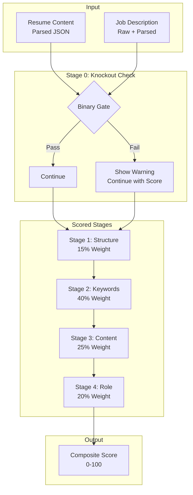
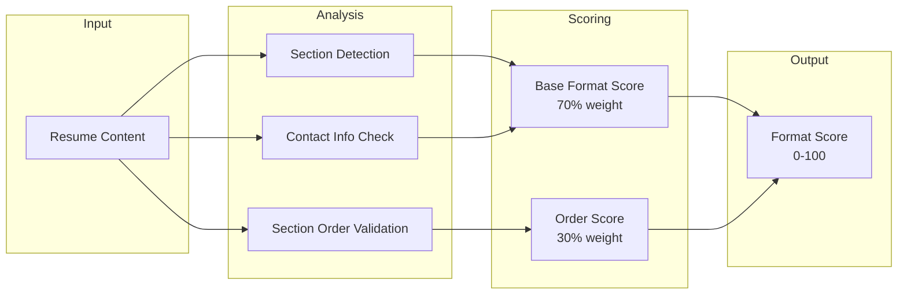
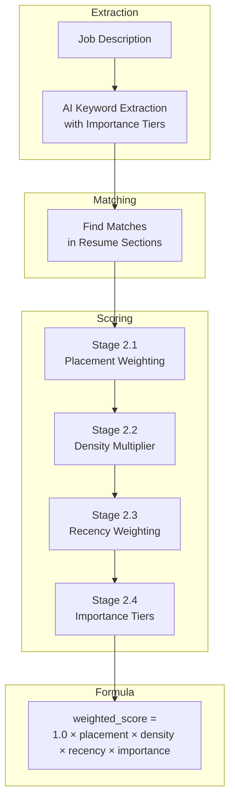
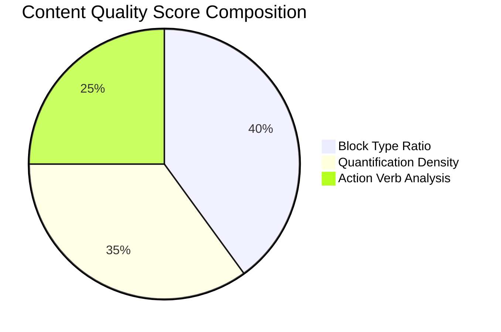
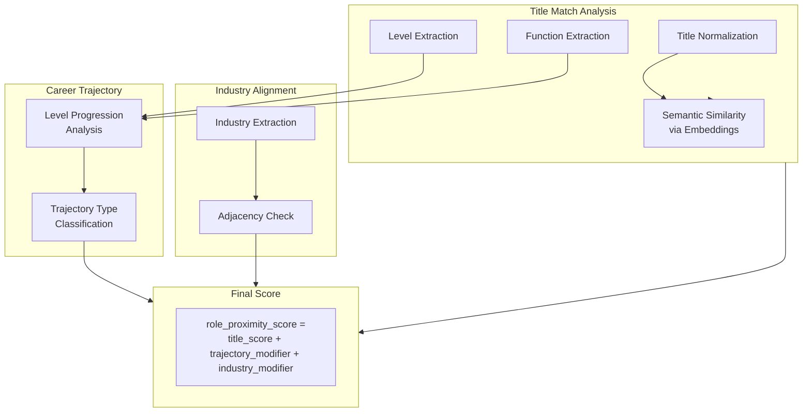
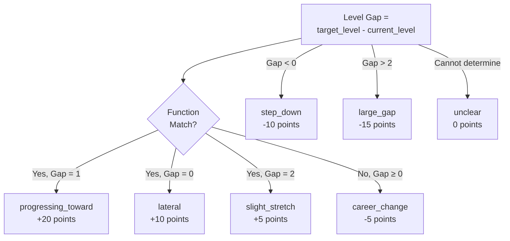
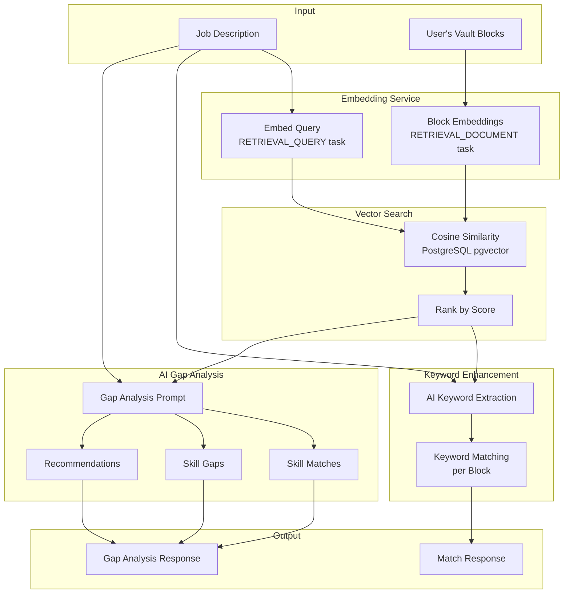
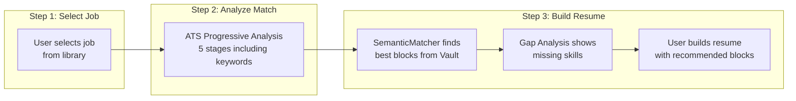

# ATS Scoring System Architecture

## Executive Summary

The ATS (Applicant Tracking System) scoring system is a 5-stage progressive analysis pipeline designed to reverse-engineer how real ATS software evaluates resumes against job descriptions. This enables job seekers to optimize their resumes for better automated screening outcomes.

**Pipeline Stages:**

| Stage | Name | Type | Weight |
| ----- | ---- | ---- | ------ |
| 0 | Knockout Check | Binary Gate | N/A (pass/fail) |
| 1 | Structure Analysis | Scored | 15% |
| 2 | Keyword Analysis | Scored | 40% |
| 3 | Content Quality | Scored | 25% |
| 4 | Role Proximity | Scored | 20% |

**Composite Score Formula:**

```text
composite_score = (structure × 0.15) + (keywords × 0.40) + (content × 0.25) + (role × 0.20)
```

If a stage fails, remaining weights are normalized to sum to 1.0.

---

## Architecture Overview



---

## Stage 0: Knockout Check (Binary Gate)

**Purpose:** Identify hard disqualifiers BEFORE calculating match score. These are criteria that would cause automatic rejection by most ATS systems.

**Source File:** `/backend/app/services/job/ats/analyzers/knockout.py`

### Knockout Criteria

| Check | Description | Severity Logic |
| ----- | ----------- | -------------- |
| Years of Experience | Compares candidate's total experience against job requirement | Critical if gap ≥ 2 years or < 60% of required for 5+ year roles |
| Education Level | Validates minimum degree requirement | Critical if 2+ levels below requirement |
| Required Certifications | Checks for explicitly required certifications | Critical for "required", Warning for "preferred" |
| Location/Work Authorization | Identifies geographic mismatches for on-site roles | Warning level only |

### Severity Levels

```typescript
type KnockoutSeverity = "critical" | "warning" | "info"
```

- **Critical:** High likelihood of automatic rejection. Address before applying.
- **Warning:** May affect candidacy but not guaranteed rejection.

### Output Schema

```typescript
interface KnockoutCheckResult {
  passes_all_checks: boolean;
  risks: KnockoutRisk[];
  summary: string;
  recommendation: string;
  analysis: {
    experience: { user_years: number | null; required_years: number | null; risk: KnockoutRisk | null };
    education: { user_level: string | null; required_level: string | null; risk: KnockoutRisk | null };
    certifications: { matched: string[]; missing: string[]; risks: KnockoutRisk[] };
    location: { user_location: string | null; job_location: string | null; risk: KnockoutRisk | null };
  };
}
```

### Education Level Hierarchy

Defined in `/backend/app/services/job/ats/constants/education.py`:

```python
EDUCATION_LEVELS = {
    "none": 0,
    "high_school": 1,
    "associate": 2,
    "bachelors": 3,
    "masters": 4,
    "phd": 5,
    "doctorate": 5,
}
```

---

## Stage 1: Structure Analysis (15% Weight)

**Purpose:** Validate ATS-friendly resume format. Some ATS systems (notably Taleo) penalize non-standard section ordering.

**Source File:** `/backend/app/services/job/ats/analyzers/structure.py`

### Structure Analysis Components



### Expected Section Order

```python
EXPECTED_SECTION_ORDER = [
    "contact",       # 1. Contact Information (always first)
    "summary",       # 2. Summary/Objective (optional)
    "experience",    # 3. Work Experience (required)
    "education",     # 4. Education (required)
    "skills",        # 5. Skills
    "certifications",# 6. Certifications/Awards (optional)
    "projects",      # 7. Projects (optional)
]
```

### Section Order Scoring

Defined in `/backend/app/services/job/ats/analyzers/base.py`:

| Deviation Type | Score | Example |
| -------------- | ----- | ------- |
| standard | 100 | Perfect or acceptable order |
| minor | 95 | Skills before Education |
| major | 85 | Education before Experience |
| non_standard | 75 | Completely non-standard order |

### Format Score Calculation

```text
base_format_score = (sections_found + contact_completeness) / total_checks × 100
format_score = base_format_score × 0.7 + section_order_score × 0.3
```

---

## Stage 2: Keyword Analysis (40% Weight)

**Purpose:** Match job requirements with sophisticated weighted scoring. This is the highest-weighted stage as keyword matching is the primary ATS filtering mechanism.

**Source Files:**

- `/backend/app/services/job/ats/analyzers/keyword/analyzer.py`
- `/backend/app/services/job/ats/analyzers/keyword/scorer.py`
- `/backend/app/services/job/ats/analyzers/keyword/matcher.py`

### 4-Stage Scoring Pipeline



### Stage 2.1: Placement Weighting

Keywords in demonstration sections (experience, projects) are weighted higher than claim sections (skills, summary).

Defined in `/backend/app/services/job/ats/constants/weights.py`:

```python
SECTION_PLACEMENT_WEIGHTS = {
    "experience": 1.0,      # Demonstrated experience - highest weight
    "projects": 0.9,        # Applied knowledge
    "skills": 0.7,          # Listed but not demonstrated
    "summary": 0.6,         # Claims without evidence
    "education": 0.5,       # Academic context
    "certifications": 0.5,  # Certifications section
    "other": 0.5,           # Default for unrecognized sections
}
```

### Stage 2.2: Density Multiplier

Multiple keyword occurrences increase score with diminishing returns and a cap:

```python
DENSITY_MULTIPLIERS = {
    1: 1.0,
    2: 1.3,
    3: 1.5,
    # 4+ uses cap of 1.5
}
DENSITY_CAP = 1.5
```

### Stage 2.3: Recency Weighting

Keywords in recent roles are weighted higher:

```python
RECENCY_WEIGHTS = {
    0: 2.0,  # Most recent role (index 0)
    1: 2.0,  # Second most recent
    2: 1.0,  # Third most recent
    # Older roles use 0.8 (RECENCY_DEFAULT)
}
RECENCY_DEFAULT = 0.8
```

### Stage 2.4: Importance Tier Weighting

Keywords are categorized by importance during AI extraction:

```python
IMPORTANCE_WEIGHTS = {
    "required": 3.0,
    "strongly_preferred": 2.0,
    "preferred": 1.5,
    "nice_to_have": 1.0,
}
```

### Final Keyword Score Formula

```python
weighted_score = 1.0 × placement_weight × density_multiplier × recency_weight × importance_weight
keyword_score = (total_weighted_score / max_possible_score) × 100
```

### Gap Analysis with Vault

For missing keywords, the system checks if they exist in the user's vault (block library):

- **In Vault:** Suggest adding relevant blocks to resume
- **Not in Vault:** Flag as gap in experience

---

## Stage 3: Content Quality (25% Weight)

**Purpose:** Evaluate resume bullet point quality using achievement vs. responsibility classification, quantification density, and action verb analysis.

**Source File:** `/backend/app/services/job/ats/analyzers/content.py`

### Content Quality Components



```python
content_quality_score = (
    block_type_score × 0.4 +
    quantification_score × 0.35 +
    action_verb_score × 0.25
)
```

### Component 1: Block Type Classification (40%)

Classifies each bullet as achievement, responsibility, or project:

| Classification | Criteria | Example |
| -------------- | -------- | ------- |
| Achievement | Has quantification OR (action verb + no weak phrases) | "Increased revenue by 40%" |
| Project | Has creation verbs but no metrics | "Built customer dashboard" |
| Responsibility | Has weak phrases OR (no quant + no strong action) | "Responsible for managing team" |

**Target:** 60%+ achievement/project ratio

### Component 2: Quantification Density (35%)

Detects numeric metrics using regex patterns from `/backend/app/services/job/ats/constants/patterns.py`:

```python
QUANTIFICATION_PATTERNS = [
    r'\d+\s*%',                    # Percentages: "40%"
    r'\$[\d,]+(?:\.\d{2})?[KMB]?', # Currency: "$50K", "$1.2M"
    r'\d+[KMB]\b',                 # Abbreviated: "50K users"
    r'\d+[xX]\s*(?:improvement|increase|growth|faster)',  # Multiples: "3x improvement"
    # ... additional patterns
]
```

**Target:** 50%+ of bullets should contain metrics

### Component 3: Action Verb Analysis (25%)

Detects strong action verbs by category:

```python
ACTION_VERB_PATTERNS = {
    "leadership": [r'\b(?:led|lead|managed|directed|supervised|mentored)\b'],
    "achievement": [r'\b(?:achieved|accomplished|attained|exceeded|surpassed|delivered)\b'],
    "creation": [r'\b(?:built|created|designed|developed|established|launched)\b'],
    "improvement": [r'\b(?:improved|enhanced|optimized|streamlined|increased|reduced)\b'],
    "analysis": [r'\b(?:analyzed|evaluated|assessed|identified|researched)\b'],
    "influence": [r'\b(?:negotiated|persuaded|influenced|collaborated|partnered)\b'],
}
```

**Weak Phrase Detection:**

```python
WEAK_PHRASE_PATTERNS = [
    r'\b(?:responsible\s+for|duties\s+included?|assisted\s+with|helped\s+with)\b',
    r'\b(?:participated\s+in|contributed\s+to|was\s+part\s+of|tasked\s+with)\b',
]
```

**Target:** 80%+ action verb coverage, <20% weak phrases

### Bullet Quality Score

Individual bullet quality:

```text
score = 0.3 (base) + 0.4 (if quantified) + 0.3 (if action verb) - 0.2 (if weak phrase)
```

---

## Stage 4: Role Proximity (20% Weight)

**Purpose:** Assess career trajectory fit by analyzing title similarity, seniority progression, and industry alignment.

**Source File:** `/backend/app/services/job/ats/analyzers/role.py`

### Role Proximity Components



### Title Normalization

Expands abbreviations and standardizes formats:

```python
TITLE_ABBREVIATIONS = {
    "sr.": "senior", "sr": "senior",
    "jr.": "junior", "jr": "junior",
    "swe": "software engineer",
    "sde": "software development engineer",
    "pm": "product manager",
    "vp": "vice president",
    "cto": "chief technology officer",
    # ... additional mappings
}
```

**Example:** "Sr. SWE III" → "senior software engineer iii"

### Seniority Level Hierarchy

Defined in `/backend/app/services/job/ats/constants/titles.py`:

```python
LEVEL_HIERARCHY = {
    "intern": 0,
    "junior": 1, "associate": 1, "entry": 1,
    "mid": 2,
    "senior": 3,
    "staff": 4, "lead": 4,
    "principal": 5, "manager": 5, "fellow": 5,
    "director": 6, "head": 6,
    "vp": 7, "vice president": 7,
    "c-level": 8, "chief": 8,
}
```

### Career Trajectory Classification



### Trajectory Score Modifiers

```python
TRAJECTORY_MODIFIERS = {
    "progressing_toward": 20,   # Natural next step up
    "lateral": 10,              # Same level, same function
    "slight_stretch": 5,        # One level up, achievable
    "step_down": -10,           # Moving to lower level
    "large_gap": -15,           # 3+ level jump
    "career_change": -5,        # Different function
    "unclear": 0,               # Cannot determine
}
```

### Industry Alignment

Defined in `/backend/app/services/job/ats/constants/industry.py`:

| Alignment Type | Modifier | Criteria |
| -------------- | -------- | -------- |
| same | +10 | Current role in same industry |
| adjacent | +5 | Current role in related industry |
| unrelated | 0 | No industry overlap |

**Industry Taxonomy with Adjacencies:**

```python
INDUSTRY_TAXONOMY = {
    "tech": {
        "names": ["technology", "software", "saas", "startup"],
        "adjacent": ["fintech", "healthtech", "edtech", "media"],
    },
    "finance": {
        "names": ["finance", "banking", "investment"],
        "adjacent": ["fintech", "insurance", "consulting"],
    },
    # ... additional industries
}
```

---

## Composite Score Calculation

**Source File:** `/backend/app/api/routes/ats/helpers.py`

### Weight Distribution

```python
STAGE_WEIGHTS = {
    "structure": 0.15,          # Stage 1
    "keywords-enhanced": 0.40,  # Stage 2
    "content-quality": 0.25,    # Stage 3
    "role-proximity": 0.20,     # Stage 4
}
```

### Score Extraction per Stage

```python
if stage_key == "structure":
    scores[stage_key] = float(result.format_score)
elif stage_key == "keywords-enhanced":
    scores[stage_key] = float(result.keyword_score)
elif stage_key == "content-quality":
    scores[stage_key] = float(result.content_quality_score)
elif stage_key == "role-proximity":
    scores[stage_key] = float(result.role_proximity_score)
```

### Weight Normalization

If any stage fails, remaining weights are normalized to sum to 1.0:

```python
if available_weight < 1.0 and available_weight > 0:
    normalization_factor = 1.0 / available_weight
    weights = {k: v * normalization_factor for k, v in weights.items() if k in scores}
```

### Knockout Flag Handling

Knockout risks are surfaced alongside the composite score but do not directly reduce the score. The UI displays the score with warnings if knockout risks exist.

---

## API Endpoints

### Progressive Analysis with SSE

**Endpoint:** `GET /api/v1/ats/analyze-progressive`

**Source File:** `/backend/app/api/routes/ats/progressive.py`

**Query Parameters:**

| Parameter | Type | Description |
| --------- | ---- | ----------- |
| resume_id | string | Resume MongoDB ObjectId |
| job_id | int | User-created job PostgreSQL ID (optional) |
| job_listing_id | int | Scraped job listing PostgreSQL ID (optional) |
| force_refresh | bool | Skip cache and run fresh analysis |

**SSE Event Types:**

| Event | Description |
| ----- | ----------- |
| cache_hit | Cached results found, returning fast playback |
| cache_miss | No cached results, running full analysis |
| stage_start | Stage N is beginning |
| stage_complete | Stage N completed successfully (includes result data) |
| stage_error | Stage N failed (includes error message, continues to next stage) |
| score_calculation | Calculating final composite score |
| complete | All stages finished, composite score ready |
| error | Fatal error that aborts entire analysis |

### Caching Strategy

- **Cache Key:** `ats:{resume_content_hash[:16]}:{job_id}`
- **TTL:** 24 hours
- **Behavior:** On cache hit, streams cached results as fast playback

---

## Frontend Display

### Page Flow

**Route:** `/tailor/analyze?resume_id=X&job_listing_id=Y`

### State Management

**Store:** `/frontend/src/lib/stores/atsProgressStore.ts`

Uses Zustand with persistence for:

- Stage results and statuses
- Composite score
- Analysis progress
- EventSource connection management

### Key Components

**ATSProgressStepper:** `/frontend/src/components/ats/ATSProgressStepper.tsx`

- 5-stage horizontal progress display with animations
- Motion animations for stage transitions
- Real-time progress bar

**useATSProgressStream Hook:** `/frontend/src/hooks/useATSProgressStream.ts`

- SSE connection management
- Stage state transformation
- Retry and abort functionality

### Stage Configuration

```typescript
const STAGE_CONFIG = [
  { stage: 0, name: "Knockout Check" },
  { stage: 1, name: "Structure Analysis" },
  { stage: 2, name: "Keyword Matching" },
  { stage: 3, name: "Content Quality" },
  { stage: 4, name: "Role Proximity" },
];
```

---

## Source File Reference

### Backend Analyzers

| File | Purpose |
| ---- | ------- |
| `/backend/app/services/job/ats/analyzers/knockout.py` | Stage 0: Knockout risk detection |
| `/backend/app/services/job/ats/analyzers/structure.py` | Stage 1: Format and section analysis |
| `/backend/app/services/job/ats/analyzers/keyword/analyzer.py` | Stage 2: Main keyword analysis orchestrator |
| `/backend/app/services/job/ats/analyzers/keyword/scorer.py` | Stage 2: Weighted scoring functions |
| `/backend/app/services/job/ats/analyzers/keyword/matcher.py` | Stage 2: Keyword matching in resume |
| `/backend/app/services/job/ats/analyzers/keyword/extractor.py` | Stage 2: AI keyword extraction from job |
| `/backend/app/services/job/ats/analyzers/content.py` | Stage 3: Content quality analysis |
| `/backend/app/services/job/ats/analyzers/role.py` | Stage 4: Role proximity analysis |

### Backend Constants

| File | Purpose |
| ---- | ------- |
| `/backend/app/services/job/ats/constants/weights.py` | Scoring weights and thresholds |
| `/backend/app/services/job/ats/constants/patterns.py` | Regex patterns for content analysis |
| `/backend/app/services/job/ats/constants/titles.py` | Title normalization and level hierarchy |
| `/backend/app/services/job/ats/constants/industry.py` | Industry taxonomy with adjacencies |
| `/backend/app/services/job/ats/constants/education.py` | Education levels and patterns |

### Backend API

| File | Purpose |
| ---- | ------- |
| `/backend/app/api/routes/ats/progressive.py` | SSE streaming endpoint |
| `/backend/app/api/routes/ats/helpers.py` | Stage execution and composite score calculation |

### Frontend

| File | Purpose |
| ---- | ------- |
| `/frontend/src/lib/stores/atsProgressStore.ts` | Zustand state management |
| `/frontend/src/hooks/useATSProgressStream.ts` | SSE hook for ATS analysis |
| `/frontend/src/components/ats/ATSProgressStepper.tsx` | Progress UI component |

---

## Semantic Matcher: Gap Analysis System

In addition to the ATS keyword analysis (Stage 2), the application includes a separate **SemanticMatcher** system for vector-based experience matching and AI-powered gap analysis.

### System Comparison

| Aspect | ATS Stage 2 Keyword Analysis | SemanticMatcher Gap Analysis |
| ------ | ---------------------------- | ---------------------------- |
| **Purpose** | Score keyword coverage in a resume | Find relevant Vault blocks + identify skill gaps |
| **Method** | Regex matching + weighted scoring | Vector embeddings + AI analysis |
| **Input** | Parsed resume JSON + job description | Job description + user's Vault blocks |
| **Output** | Keyword score (0-100) + matched/missing lists | Match score + skill gaps + recommendations |
| **API** | `GET /api/v1/ats/analyze-progressive` | `POST /api/v1/match/analyze` |
| **Use Case** | Real-time ATS score on `/tailor/analyze` | Block recommendations for resume building |

### Architecture Overviews



#### Section Descriptions

**Input:** The two data sources that feed the semantic matching pipeline. The **Job Description** contains the target role's requirements, responsibilities, and qualifications. **User's Vault Blocks** are the user's stored experience bullets, project descriptions, and skill entries that represent their professional history.

**Embedding Service:** Converts text into dense vector representations for semantic comparison. Uses different task types optimized for asymmetric retrieval:

- **Embed Query (RETRIEVAL_QUERY):** Optimizes the job description embedding for finding relevant documents
- **Block Embeddings (RETRIEVAL_DOCUMENT):** Pre-computed embeddings stored with each Vault block, optimized for being found by queries

**Vector Search:** Performs similarity matching in vector space using PostgreSQL's pgvector extension:

- **Cosine Similarity:** Measures the angle between the query vector (job description) and document vectors (blocks), returning scores from 0.0 to 1.0
- **Rank by Score:** Orders matched blocks from most to least semantically similar, typically returning the top 20 candidates

**Keyword Enhancement:** Augments vector similarity with explicit keyword matching for interpretability:

- **AI Keyword Extraction:** Uses an LLM to extract 5-15 important keywords from the job description (skills, tools, responsibilities)
- **Keyword Matching per Block:** Scans each ranked block to identify which extracted keywords appear, enabling the UI to highlight why a block matched

**AI Gap Analysis:** Provides strategic career guidance by comparing matched experience against job requirements:

- **Gap Analysis Prompt:** Sends the job description and top matched blocks to an LLM for holistic analysis
- **Skill Matches:** Skills the candidate demonstrably has based on their Vault content
- **Skill Gaps:** Required skills not evident in the candidate's experience
- **Recommendations:** Actionable advice for improving fit (e.g., "highlight Kubernetes experience if you have any")

**Output:** Two distinct response types for different use cases:

- **Match Response:** Returns ranked blocks with scores and matched keywords—used for block recommendations during resume building
- **Gap Analysis Response:** Returns the strategic analysis (match score, gaps, recommendations)—used for career guidance and identifying areas to develop

---

### Embedding Service

**Source File:** `/backend/app/services/ai/embedding.py`

The embedding service generates vector representations for semantic search. It uses different task types for optimal retrieval:

| Task Type | Use Case | When Used |
| --------- | -------- | --------- |
| `RETRIEVAL_DOCUMENT` | Indexing content for search | When storing/updating Vault blocks |
| `RETRIEVAL_QUERY` | Searching indexed content | When matching job description to blocks |

**Supported Providers:**

- Google Gemini (default) - `text-embedding-004`
- OpenAI - `text-embedding-3-small`

```python
# Embed job description for search (query task type)
query_embedding = await embedding_service.embed_query(job_description)

# Search user's blocks using vector similarity
matches = await block_repository.search_semantic(
    db, user_id=user_id, query_embedding=query_embedding, limit=20
)
```

---

### Semantic Matcher Service

**Source File:** `/backend/app/services/ai/semantic_matcher.py`

The `SemanticMatcher` orchestrates the full matching pipeline:

#### Method 1: `match()` - Find Relevant Blocks

1. Embed job description with RETRIEVAL_QUERY task type
2. Search user's blocks using vector similarity (pgvector)
3. Extract keywords from job description
4. Enhance matches with keyword highlighting
5. Return ranked `SemanticMatchData` list

```python
matches = await matcher.match(
    db=db,
    user_id=user_id,
    job_description=job_description,
    limit=20,
    block_types=["experience", "project"],
    tags=["python", "backend"],
)
```

#### Method 2: `extract_keywords()` - AI Keyword Extraction

Extracts 5-15 keywords from job description using AI:

**AI Prompt:**

```text
Extract the most important keywords and phrases that represent:
1. Required technical skills (programming languages, frameworks, tools)
2. Required soft skills (leadership, communication, etc.)
3. Domain expertise (industries, methodologies)
4. Key responsibilities
5. Nice-to-have qualifications

RULES:
1. Extract 5-15 keywords/phrases
2. Use lowercase
3. Be specific (prefer "kubernetes" over "container orchestration")
4. Include both hard and soft skills
5. Prioritize requirements mentioned multiple times or marked as required
```

**Output:** JSON array of keywords: `["python", "kubernetes", "team leadership", ...]`

#### Method 3: `analyze_gaps()` - AI Gap Analysis

Analyzes skill gaps between job requirements and matched experience:

**AI Prompt:**

```text
Given a job description and matched experience blocks, analyze:
1. How well the candidate's experience matches the job requirements
2. Which skills/requirements are well-covered
3. Which skills/requirements have gaps
4. Recommendations for the candidate

Provide analysis in this exact JSON format:
{
  "match_score": <0-100 integer>,
  "skill_matches": ["skill1", "skill2"],
  "skill_gaps": ["skill1", "skill2"],
  "keyword_coverage": <0.0-1.0 float>,
  "recommendations": ["recommendation1", "recommendation2"]
}

RULES:
1. Be honest about gaps - don't inflate match_score
2. skill_matches: skills the candidate clearly has
3. skill_gaps: required skills not evident in experience
4. keyword_coverage: ratio of job keywords found in experience
5. recommendations: actionable advice for improving fit
```

---

### API Endpoints to the architecture

**Source File:** `/backend/app/api/routes/match.py`

#### POST /api/v1/match

Find experience blocks that match a job description.

**Request Body:**

```json
{
  "job_description": "We are looking for a Senior Python Developer...",
  "limit": 20,
  "block_types": ["experience", "project"],
  "tags": ["python"]
}
```

**Response:**

```json
{
  "matches": [
    {
      "block": {
        "id": 123,
        "content": "Led development of Python microservices...",
        "block_type": "experience",
        "tags": ["python", "microservices"]
      },
      "score": 0.89,
      "matched_keywords": ["python", "microservices", "leadership"]
    }
  ],
  "query_keywords": ["python", "senior", "microservices", "leadership"],
  "total_vault_blocks": 45
}
```

#### POST /api/v1/match/analyze

Perform semantic matching + gap analysis.

**Request Body:**

```json
{
  "job_description": "We are looking for a Senior Python Developer..."
}
```

**Response:**

```json
{
  "match_score": 75,
  "skill_matches": ["python", "microservices", "aws", "team leadership"],
  "skill_gaps": ["kubernetes", "terraform", "ci/cd"],
  "keyword_coverage": 0.67,
  "recommendations": [
    "Add Kubernetes experience to your resume if you have any",
    "Highlight any CI/CD pipeline work you've done",
    "Consider getting Terraform certification"
  ]
}
```

#### GET /api/v1/match/job/{job_id}

Get cached match results for a previously analyzed job.

- Falls back to fresh analysis if not cached
- 15-minute TTL on cache
- Uses cache key: `match:{user_id}:{job_id}:{limit}`

---

### Data Models

**Source File:** `/backend/app/core/protocols.py`

#### SemanticMatchData

```python
@dataclass
class SemanticMatchData:
    block: BlockData          # The matched experience block
    score: float              # Similarity score (0.0-1.0)
    matched_keywords: list[str]  # Keywords found in this block
```

#### GapAnalysisData

```python
@dataclass
class GapAnalysisData:
    match_score: int          # Overall match (0-100)
    skill_matches: list[str]  # Skills candidate has
    skill_gaps: list[str]     # Skills missing from experience
    keyword_coverage: float   # Ratio of keywords found (0.0-1.0)
    recommendations: list[str]  # Actionable advice
```

---

### Detail Caching Strategy

| Endpoint | Cache Key | TTL |
| -------- | --------- | --- |
| `/match/job/{job_id}` | `match:{user_id}:{job_id}:{limit}` | 15 minutes |
| `/match` | No caching | N/A |
| `/match/analyze` | No caching | N/A |

---

### Integration with Tailor Flow

The SemanticMatcher powers the **block recommendation** feature in the tailoring workflow:



### Source Files Reference

| File | Purpose |
| ---- | ------- |
| `/backend/app/services/ai/semantic_matcher.py` | SemanticMatcher service |
| `/backend/app/services/ai/embedding.py` | Embedding generation service |
| `/backend/app/api/routes/match.py` | Match API endpoints |
| `/backend/app/crud/block.py` | Block repository with `search_semantic()` |
| `/backend/app/core/protocols.py` | SemanticMatchData, GapAnalysisData |
