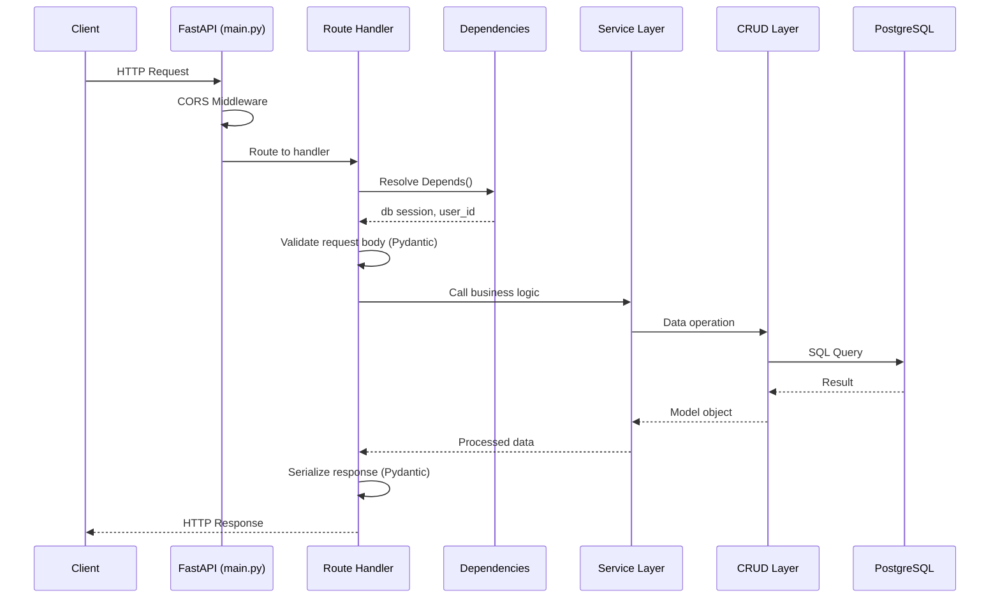
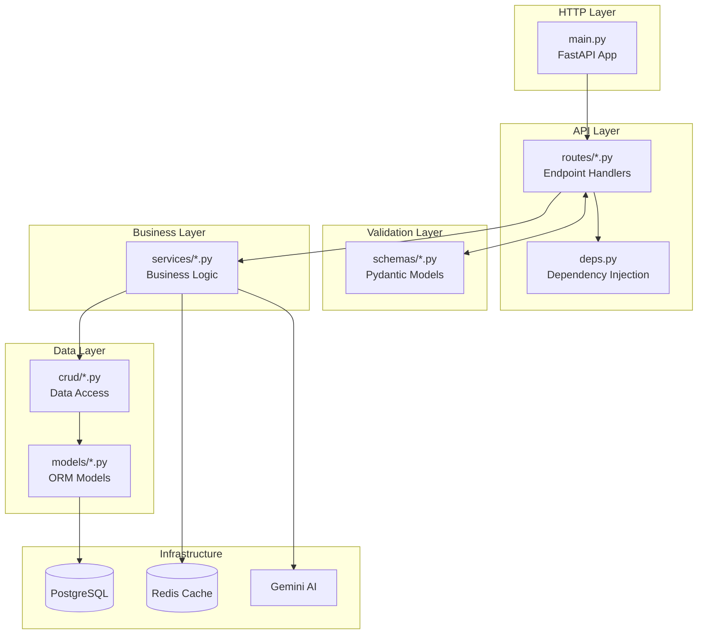
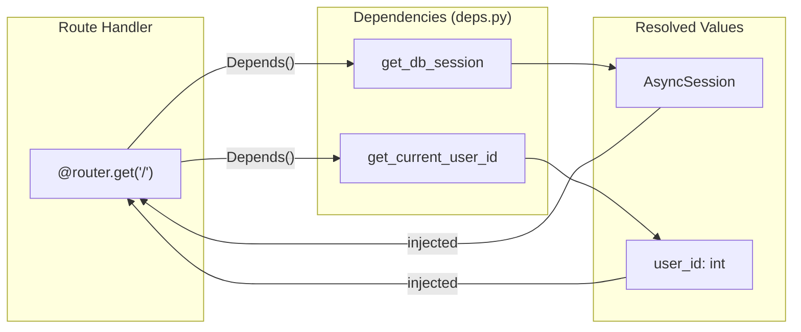
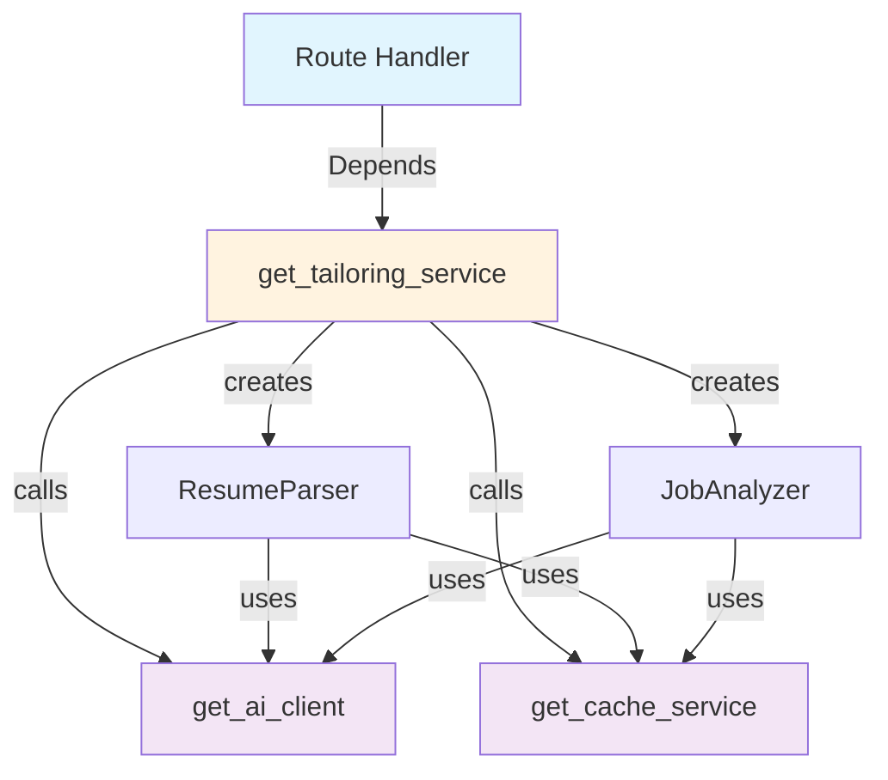
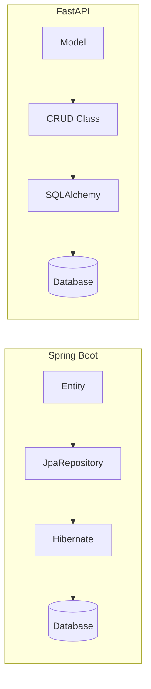
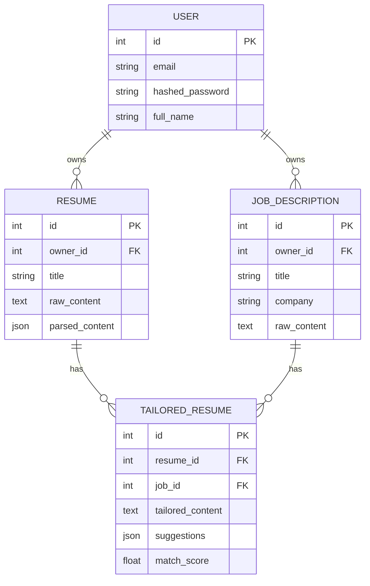
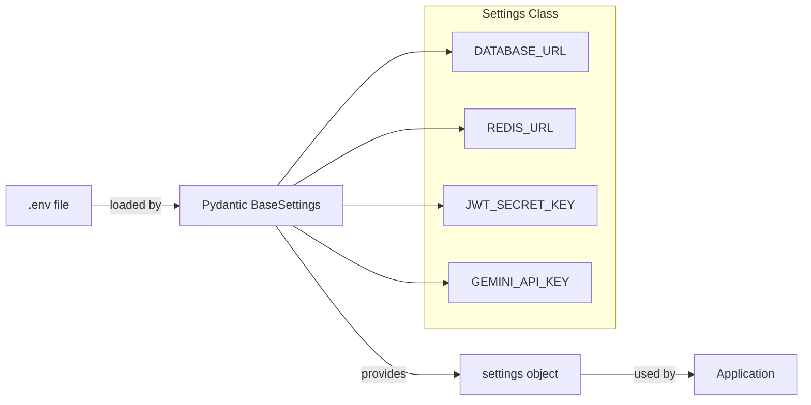
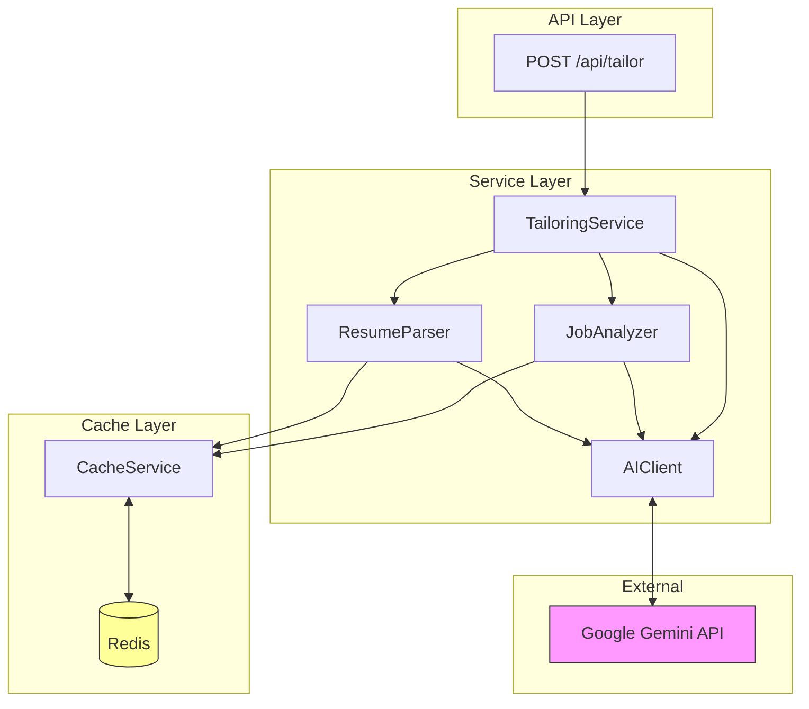
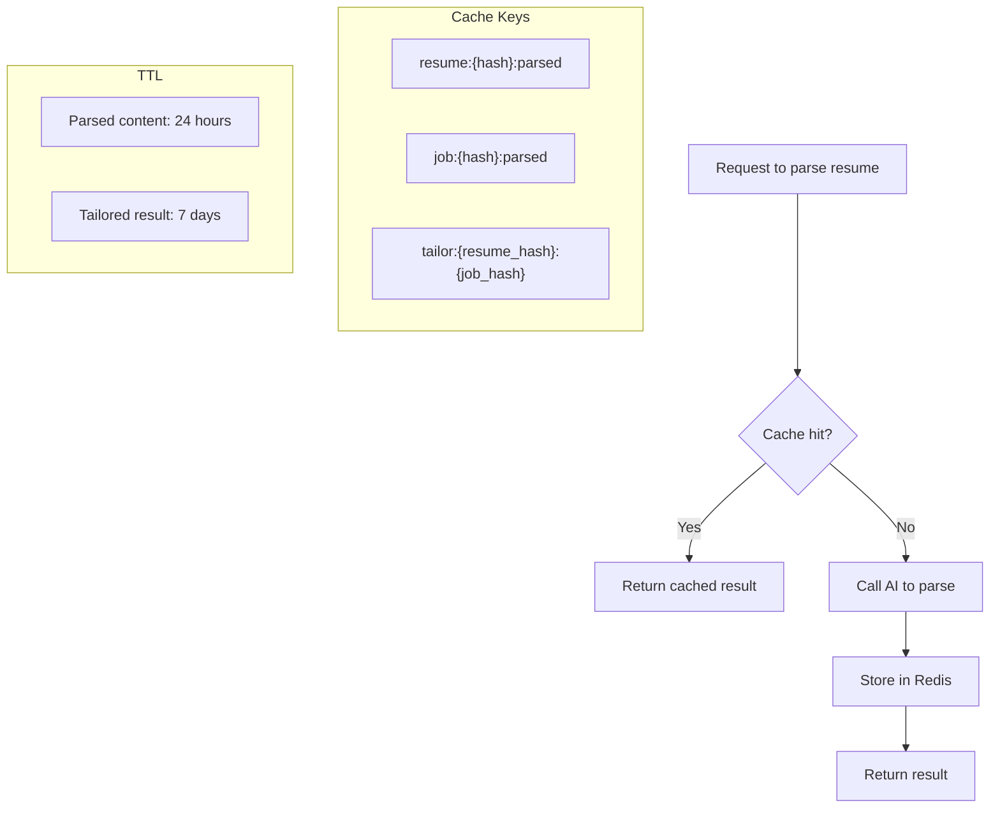

# Backend Architecture Guide

A guide for developers familiar with Java Spring Boot transitioning to Python FastAPI.

---

## Table of Contents

1. [Project Structure](#project-structure)
2. [Spring Boot to FastAPI Mapping](#spring-boot-to-fastapi-mapping)
3. [Request Lifecycle](#request-lifecycle)
4. [Layer-by-Layer Breakdown](#layer-by-layer-breakdown)
5. [Dependency Injection](#dependency-injection)
6. [Database & ORM](#database--orm)
7. [Configuration Management](#configuration-management)
8. [Service Architecture](#service-architecture)

---

## Project Structure

```
backend/app/
├── main.py           # Application entry point
├── api/
│   ├── __init__.py   # Router aggregation
│   ├── deps.py       # Dependency providers
│   └── routes/       # Endpoint handlers
│       ├── auth.py
│       ├── resumes.py
│       ├── jobs.py
│       └── tailor.py
├── core/
│   ├── config.py     # Environment configuration
│   └── security.py   # Auth utilities
├── db/
│   └── session.py    # Database connection
├── models/           # SQLAlchemy ORM models
├── schemas/          # Pydantic validation schemas
├── crud/             # Data access layer
└── services/         # Business logic layer
```

---

## Spring Boot to FastAPI Mapping

| Concept | Spring Boot | FastAPI |
|---------|-------------|---------|
| Entry Point | `@SpringBootApplication` | `FastAPI()` in `main.py` |
| Controllers | `@RestController` | Router functions with `@router.get()` |
| Request DTOs | `@RequestBody` classes | Pydantic `BaseModel` |
| Response DTOs | ResponseEntity / POJOs | Pydantic `BaseModel` |
| Entities | `@Entity` JPA classes | SQLAlchemy `Model` classes |
| Repositories | `JpaRepository` | CRUD classes |
| Services | `@Service` classes | Service classes |
| DI | `@Autowired` | `Depends()` function |
| Config | `application.yml` | Pydantic `BaseSettings` |
| Validation | `@Valid`, `@NotNull` | Pydantic field validators |

---

## Request Lifecycle

How an HTTP request flows through the application:



---

## Layer-by-Layer Breakdown

### Overview



### 1. Entry Point (`main.py`)

```python
# Equivalent to @SpringBootApplication
app = FastAPI(title="AI Resume Tailor")

# Middleware (like Spring filters)
app.add_middleware(CORSMiddleware, ...)

# Register routes (like @ComponentScan finding controllers)
app.include_router(api_router, prefix="/api")
```

### 2. Routes (`api/routes/*.py`)

```python
# Equivalent to @RestController + @RequestMapping
router = APIRouter(prefix="/resumes", tags=["resumes"])

# Equivalent to @PostMapping
@router.post("/", response_model=ResumeResponse)
async def create_resume(
    resume_in: ResumeCreate,                      # @RequestBody (auto-validated)
    db: AsyncSession = Depends(get_db_session),   # @Autowired
    user_id: int = Depends(get_current_user_id),  # @AuthenticationPrincipal
) -> ResumeResponse:
    # Handler logic
    ...
```

### 3. Schemas (`schemas/*.py`)

```python
# Equivalent to DTO classes with validation annotations
class ResumeCreate(BaseModel):
    title: str                    # @NotNull String title
    raw_content: str              # @NotNull String rawContent

class ResumeResponse(BaseModel):
    id: int
    title: str
    created_at: datetime

    model_config = ConfigDict(from_attributes=True)  # Enable ORM mode
```

### 4. Services (`services/*.py`)

```python
# Equivalent to @Service class
class TailoringService:
    def __init__(self, ai_client, cache, resume_parser, job_analyzer):
        self.ai_client = ai_client    # Constructor injection
        self.cache = cache
        ...

    async def tailor(self, resume, job) -> TailorResult:
        # Business logic here
        ...
```

### 5. CRUD (`crud/*.py`)

```python
# Equivalent to @Repository / JpaRepository
class ResumeCRUD:
    async def create(self, db: AsyncSession, obj_in: ResumeCreate, owner_id: int):
        db_obj = Resume(**obj_in.model_dump(), owner_id=owner_id)
        db.add(db_obj)
        await db.commit()
        return db_obj

    async def get(self, db: AsyncSession, id: int):
        result = await db.execute(select(Resume).where(Resume.id == id))
        return result.scalar_one_or_none()
```

### 6. Models (`models/*.py`)

```python
# Equivalent to @Entity JPA class
class Resume(Base):
    __tablename__ = "resumes"

    id: Mapped[int] = mapped_column(primary_key=True)
    owner_id: Mapped[int] = mapped_column(ForeignKey("users.id"))
    title: Mapped[str] = mapped_column(String(255))

    # Equivalent to @ManyToOne
    owner: Mapped["User"] = relationship(back_populates="resumes")
```

---

## Dependency Injection

FastAPI uses function-based dependency injection via `Depends()`.

### How It Works



### Code Example

```python
# deps.py - Define dependency providers
async def get_db_session() -> AsyncGenerator[AsyncSession, None]:
    async with async_session() as session:
        try:
            yield session          # Inject this value
            await session.commit()
        except Exception:
            await session.rollback()
            raise

def get_current_user_id() -> int:
    # TODO: Extract from JWT token
    return 1  # Mock for now

# routes/resumes.py - Consume dependencies
@router.get("/")
async def list_resumes(
    db: AsyncSession = Depends(get_db_session),    # Injected
    user_id: int = Depends(get_current_user_id),   # Injected
):
    return await resume_crud.get_by_owner(db, user_id)
```

### Dependency Chain

Dependencies can depend on other dependencies:



---

## Database & ORM

### SQLAlchemy vs JPA Comparison



### Async Database Session

```python
# db/session.py
engine = create_async_engine(settings.DATABASE_URL)
async_session = async_sessionmaker(engine, expire_on_commit=False)

async def get_db() -> AsyncGenerator[AsyncSession, None]:
    async with async_session() as session:
        yield session
```

### Relationship Mapping



---

## Configuration Management

### Environment Variables



### Code

```python
# core/config.py
class Settings(BaseSettings):
    DATABASE_URL: str
    REDIS_URL: str
    JWT_SECRET_KEY: str
    GEMINI_API_KEY: str

    model_config = SettingsConfigDict(env_file=".env")

@lru_cache  # Singleton pattern
def get_settings() -> Settings:
    return Settings()
```

---

## Service Architecture

### AI-Powered Tailoring Flow



### Caching Strategy



### Service Singleton Pattern

```python
# Using @lru_cache for singleton behavior
@lru_cache
def get_ai_client() -> AIClient:
    return AIClient(api_key=settings.GEMINI_API_KEY)

@lru_cache
def get_cache_service() -> CacheService:
    return CacheService(redis_url=settings.REDIS_URL)

# Factory function composes services
def get_tailoring_service() -> TailoringService:
    ai = get_ai_client()        # Singleton
    cache = get_cache_service() # Singleton
    return TailoringService(
        ai_client=ai,
        cache=cache,
        resume_parser=ResumeParser(ai, cache),
        job_analyzer=JobAnalyzer(ai, cache),
    )
```

---

## Quick Reference

### Running the Backend

```bash
# Install dependencies
cd backend
poetry install

# Run development server
poetry run uvicorn app.main:app --reload

# Run with Docker
docker-compose up backend
```

### Common Patterns

| Task | Code |
|------|------|
| Add new endpoint | Create function in `routes/*.py` with `@router.method()` |
| Add request validation | Create Pydantic model in `schemas/*.py` |
| Add database table | Create SQLAlchemy model in `models/*.py` |
| Add business logic | Create/update service in `services/*.py` |
| Add data access | Create/update CRUD class in `crud/*.py` |
| Add configuration | Add field to `Settings` in `core/config.py` |
