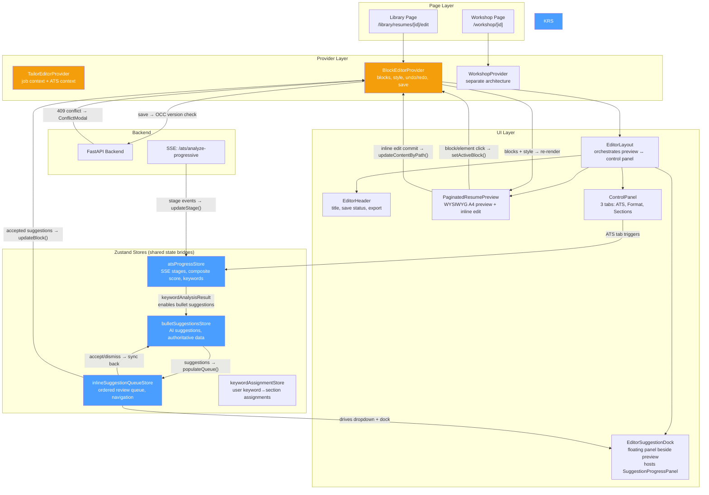
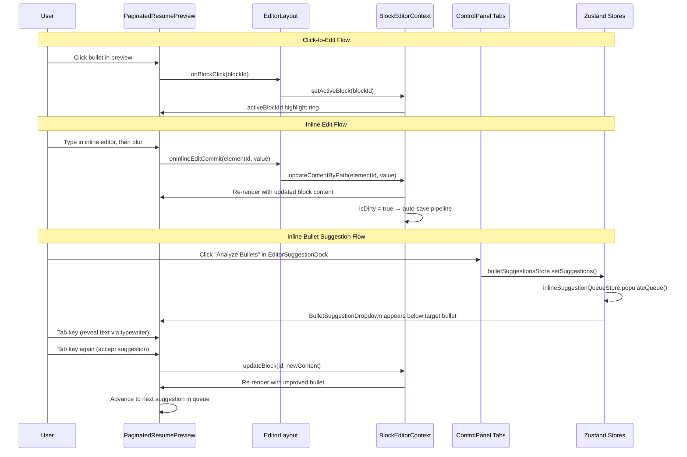
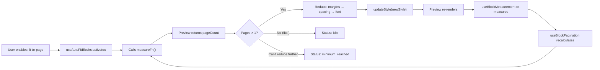
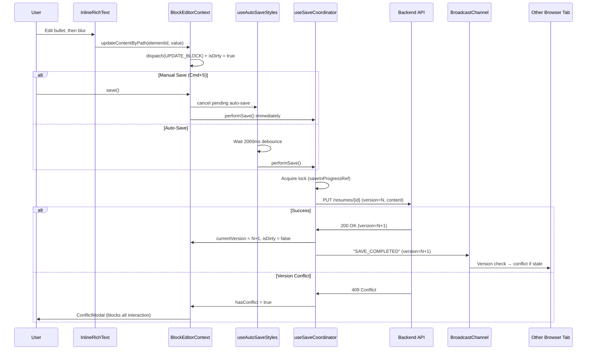
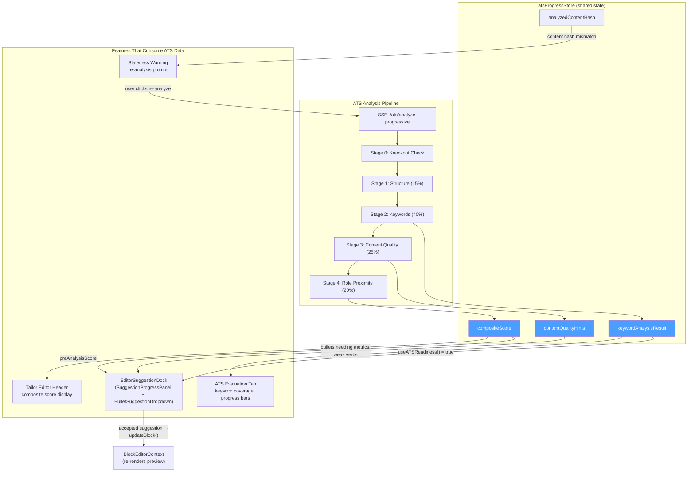
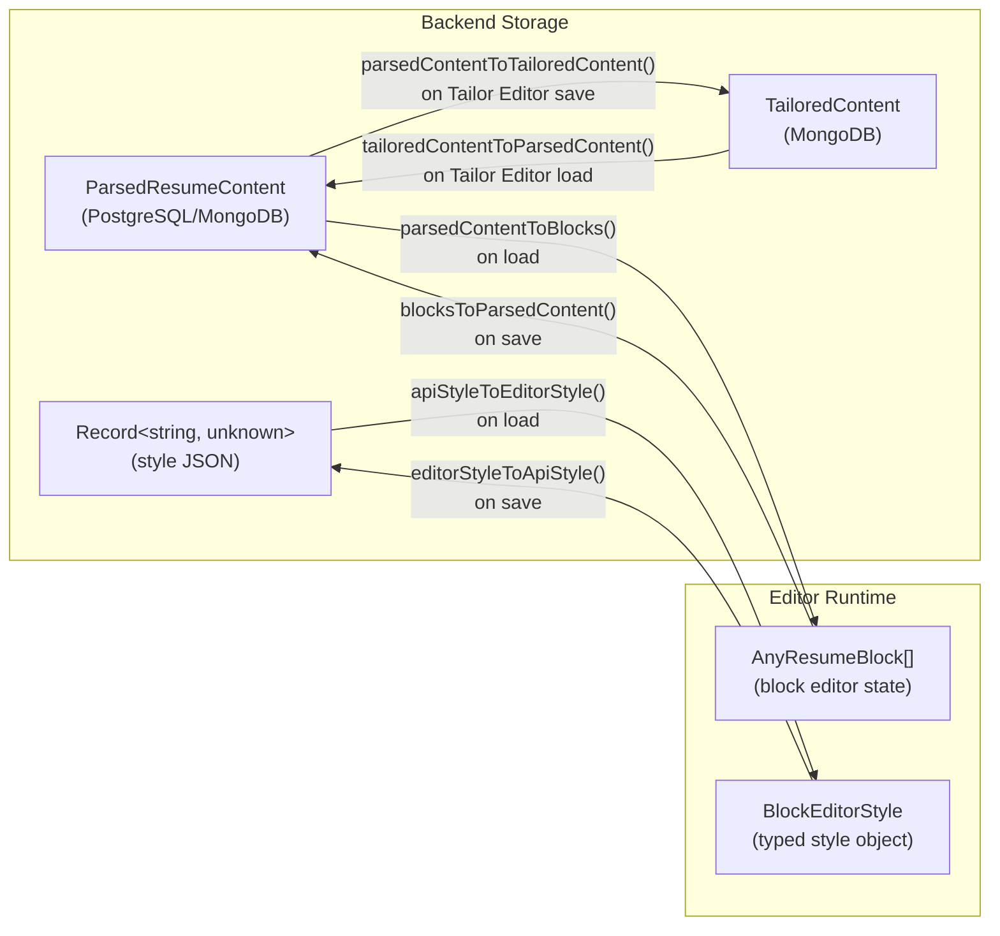
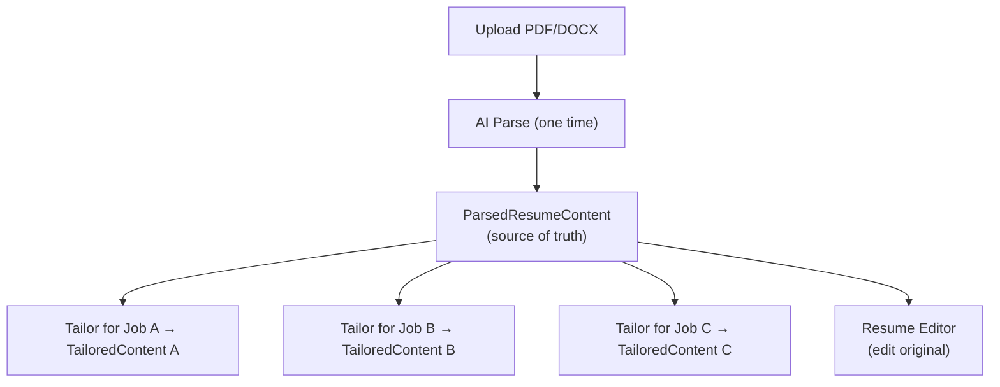

# Editor Architecture Guide

The app has one shared editor component (`EditorLayout`) serving three distinct user journeys, plus a separate Workshop editor with its own architecture. This is the canonical reference for how the editor works, what features it provides, and how they interact.

This is a **permanent reference**. Update this document whenever editor routes, feature gating, entry points, features, or new editor contexts change.

---

## System Overview

The editor is a coordinated system, not a collection of independent components. This diagram shows how the major pieces connect:



**Key relationships to understand:**

1. **EditorLayout is the orchestrator** — it wires preview callbacks to context setters and exposes the preview ref for auto-fit measurement
2. **Zustand stores are bridges** — `atsProgressStore`, `bulletSuggestionsStore`, and `inlineSuggestionQueueStore` let tabs, preview, and the floating dock coordinate without prop drilling (ATS tab's keyword analysis enables bullet-suggestion availability; the queue store drives both the inline dropdown in the preview and the `SuggestionProgressPanel` inside `EditorSuggestionDock`)
3. **Preview ↔ Context is bidirectional** — clicks in the preview update context state, context state changes re-render the preview
4. **The Tailor Editor wraps the same stack** — `TailorEditorProvider` adds job context and ATS context on top of the standard `BlockEditorProvider` → `EditorLayout` stack

---

## 1. Editor Contexts

### 1.1 Resume Editor

**Purpose:** Verify and clean up an uploaded resume — check parsing accuracy, fix formatting, reorder sections. No AI-assisted editing.

**Route:** `/library/resumes/[id]/edit` (no query params)

**Page file:** `frontend/src/app/(protected)/library/resumes/[id]/edit/page.tsx`

**Entry Points:**

| Source Page | Action | Navigation |
| ----- | ----- | ----- |
| Library resume list (`ResumeTimeline.tsx`) | "Edit" icon button | `/library/resumes/[id]/edit` |
| Resume detail (`/library/resumes/[id]`) | "Edit" / "Open Editor" button | `/library/resumes/[id]/edit` |
| Resume verify (`/library/resumes/[id]/verify`) | "Open Editor" button | `/library/resumes/[id]/edit` |

**Job Context:** None

**Provider Stack:**

```text
BlockEditorProvider → EditorLayout
```

**Auto-Parse Behavior:** If `raw_content` exists but `parsed` is null, the page triggers `useParseResume` to parse the resume with AI before loading blocks.

**Enabled Features:**

- Block-based WYSIWYG A4 preview editing
- Inline editing (rich text, plain text, skills)
- Section drag-and-drop reordering
- Section add/remove/visibility
- Formatting controls (font, spacing, margins, auto-fit)
- Undo/redo history
- Auto-save with conflict detection
- PDF export

**Disabled Features:**

- ATS tab (gated by `hasJobContext`)
- AI bullet suggestions (no job to analyze against — `EditorSuggestionDock` stays hidden)
- AI model selector (no AI features to configure)

---

### 1.2 Job-Linked Editor

**Purpose:** Edit the original resume with full AI assistance targeted at a specific job posting. The job is linked via query parameter, not embedded in the document.

**Route:** `/library/resumes/[id]/edit?jobListingId=X` or `/library/resumes/[id]/edit?jobId=X`

**Page file:** Same as Resume Editor — `frontend/src/app/(protected)/library/resumes/[id]/edit/page.tsx`. Query params toggle feature gates.

**Entry Points:**

| Source Page | Action | Navigation |
| ----- | ----- | ----- |
| Tailor keywords review (`/tailor/keywords/[id]`) | "Edit Resume" after confirming keywords | `/library/resumes/[resumeId]/edit?jobListingId=[id]` |
| Tailor analyze (`/tailor/analyze`) | "Continue" for user-created jobs | `/library/resumes/[resumeId]/edit?jobId=[jobId]` |

**Job Context:** Yes — `jobListingId` (scraped job, integer) or `jobId` (user-created job, UUID) passed as query params.

**Provider Stack:**

```text
BlockEditorProvider → EditorLayout (with jobId/jobListingId props)
```

**Enabled Features:**

- Everything from Resume Editor, plus:
- ATS scoring and keyword analysis tab
- AI bullet suggestions (after ATS keyword analysis completes) — reviewed via the inline `BulletSuggestionDropdown` in the preview and the `SuggestionProgressPanel` inside `EditorSuggestionDock`
- AI model selector

---

### 1.3 Tailor Editor (Disabled)

**Status:** Route removed. The ad-hoc tailor editor has been disabled. Its use case (pasting an external job description to tailor a resume) will merge with the Workshop Editor into a single ad-hoc editor in the future.

**Former Route:** `/tailor/editor/[id]` (deleted)

**Infrastructure retained:** `TailorEditorProvider` and `TailorEditorContext` are retained for the upcoming merged ad-hoc editor. As of attempt 7 (see `docs/features/resume-editor/ai-suggestions/AI_SUGGESTION_ATTEMPTS.md`) neither the AI Chat tab nor the Skill Suggestions panel exists anymore, so there are no current consumers of these contexts in the block editor.

---

### 1.4 Workshop Editor

**Purpose:** Real-time score calculation and content optimization during tailoring. Uses a completely separate architecture from the block editors.

**Route:** `/workshop/[id]`

**Page file:** `frontend/src/app/(protected)/workshop/[id]/page.tsx`

**Job Context:** Yes — always has job context from the tailored resume.

**Provider Stack:**

```text
WorkshopProvider → WorkshopLayout (NOT BlockEditorProvider)
```

**Architecture Difference:** The Workshop editor does NOT use `BlockEditorProvider`, `EditorLayout`, or the block-based component stack. It uses its own `WorkshopContext` with a reducer pattern and operates on `TailoredContent` directly (not `AnyResumeBlock[]`).

**Enabled Features:**

- Form-based section editing (not inline WYSIWYG)
- Real-time match score calculation (recalculates on every edit)
- Content-based ATS analysis (not SSE-driven)
- Section reordering and bullet editing
- Style controls
- Undo/redo (same `useUndoRedo` hook)
- Auto-save

**Disabled Features:**

- Inline WYSIWYG editing
- Block-level drag-and-drop
- PDF export
- AI chat
- Fit-to-one-page auto-fit

---

## 2. Naming Conventions

Use these canonical names in code comments, commit messages, and documentation to avoid ambiguity:

| User Journey | Canonical Name | Has Job | Route |
| ----- | ----- | ----- | ----- |
| From library/profile | **Resume Editor** | No | `/library/resumes/[id]/edit` |
| From job listing flow | **Job-Linked Editor** | Yes | `/library/resumes/[id]/edit?jobListingId=X` |
| ~~From tailor flow~~ | ~~**Tailor Editor**~~ | ~~Yes~~ | ~~`/tailor/editor/[id]`~~ (disabled) |
| From workshop flow | **Workshop Editor** | Yes | `/workshop/[id]` |

**Do not use** "Library editor" — it is ambiguous (could mean Resume Editor or Job-Linked Editor).

---

## 3. Feature Gating Rules

The `hasJobContext` flag is the primary gate. It is `true` when a `jobListingId`, `jobId`, or embedded job source is present. The `isTailorMode` flag (from `useTailorEditorContextSafe`) is the secondary gate for any future tailor-specific features. A third gate, the `tailoredResumeId` prop, is threaded `EditorLayout → InlineSuggestionQueueProvider → useBulletAnalysis` and is required for tailor-only bullet analysis. The prop exists in the infrastructure today but is not passed by any current entry point — it is retained for the upcoming merged ad-hoc editor (see §1.3).

| Feature | Resume Editor | Job-Linked Editor | Workshop Editor |
| ----- | ----- | ----- | ----- |
| Block editing / formatting | Yes | Yes | No (form-based) |
| Inline WYSIWYG editing | Yes | Yes | No |
| Section drag-and-drop | Yes | Yes | No |
| Undo/redo | Yes | Yes | Yes |
| Auto-save | Yes | Yes | Yes |
| PDF export | Yes | Yes | No |
| ATS tab | No | Yes | No |
| AI bullet suggestions | No | Yes | No |
| Inline suggestion dropdown | No | Yes | No |
| AI model selector | No | Yes | No |
| Real-time match score | No | No | Yes |

---

## 4. Shared Architecture

Both block editors (Resume, Job-Linked) share the same core component stack. The Workshop editor is separate.

### 4.1 Component Stack

| Component | Responsibility | Source |
| ----- | ----- | ----- |
| `BlockEditorProvider` | State management for blocks, styles, undo/redo, save coordination | `components/library/editor/BlockEditorProvider.tsx` |
| `EditorLayout` | Split-screen layout: left A4 preview (73%) + right control panel (27%), resizable via `react-resizable-panels` | `components/library/editor/EditorLayout.tsx` |
| `EditorHeader` | Top bar with resume title, save status, parse button, export button | `components/library/editor/EditorHeader.tsx` |
| `PaginatedResumePreview` | Live WYSIWYG A4 preview with pagination, interactive block/element selection, inline suggestion dropdown via portal layer | `components/library/preview/PaginatedResumePreview.tsx` |
| `ControlPanel` | Tabbed interface with 3 tabs: ATS, Format, Sections (default is Format). Bullet-suggestion review lives in `EditorSuggestionDock`, not in a tab. | `components/library/editor/ControlPanel.tsx` |
| `EditorSuggestionDock` | Floating panel pinned beside the preview; hosts `SuggestionProgressPanel` when the inline bullet-suggestion queue is active | `components/library/editor/EditorSuggestionDock.tsx` |

### 4.2 Provider Hierarchy

```text
Resume Editor:
  BlockEditorProvider
    └── EditorLayout

Job-Linked Editor (same page, query params enable features):
  BlockEditorProvider
    └── EditorLayout (jobId/jobListingId passed as props)

Workshop Editor (separate stack):
  WorkshopProvider
    └── WorkshopLayout
```

`EditorLayout` also accepts a `tailoredResumeId` prop (default `null`). When set, it is threaded to `InlineSuggestionQueueProvider` → `useBulletAnalysis` / `useInlineSuggestionQueue` to enable tailored bullet analysis. No current page passes it — see §3.

### 4.3 How Components Interact

The components form a **bidirectional loop** — the preview is both an output (renders blocks) and an input (captures user clicks/edits):



**EditorLayout as orchestrator:**

EditorLayout is the central wiring point. It:

1. Receives click/hover callbacks from the preview and forwards them to `BlockEditorContext` setters
2. Passes `activeBlockId` / `hoveredBlockId` / `activeElementId` back to the preview for visual highlighting
3. Exposes the preview ref to the auto-fit algorithm via `setAutoFitMeasureFn()`
4. Passes job IDs to the `ControlPanel` to enable/disable the ATS tab

**ControlPanel tabs — always mounted, independently stateful:**

All 3 tabs (ATS, Format, Sections) are kept in the DOM with `hidden` class toggling. This preserves their internal state when switching tabs. Cross-tab / cross-surface effects flow through shared stores:

| Source | Action | Effect on Other Components |
| ----- | ----- | ----- |
| Format tab | Enable fit-to-page | Triggers auto-fit → style changes → preview re-renders → new page count |
| Format tab | Change font/margins | Preview re-renders → content staleness detected in ATS tab |
| ATS tab | Complete keyword analysis | `keywordAnalysisResult` stored → `EditorSuggestionDock` enables bullet analysis |
| EditorSuggestionDock | Analyze bullets | `bulletSuggestionsStore` populates → `inlineSuggestionQueueStore` builds ordered queue → `BulletSuggestionDropdown` appears in preview |
| Preview / Dock | Accept bullet suggestion | `updateBlock()` → preview re-renders → `isDirty` → auto-save |
| Sections tab | Reorder blocks via drag-drop | `reorderBlocks()` → preview re-renders → pagination recalculates |

---

## 5. Block-Based Editing

The editor represents a resume as an ordered array of typed blocks (`AnyResumeBlock[]`). Each block has a unique ID, a type, typed content, an order number, and optional collapse/visibility flags.

### 5.1 Block Types

All 16 block types organized by category. Defined in `BLOCK_TYPE_INFO` at `lib/resume/defaults.ts`.

**Core Sections:**

| Type | Label | Content Type | Has Bullets |
| ----- | ----- | ----- | ----- |
| `contact` | Contact Information | `ContactContent` object | No |
| `summary` | Professional Summary | `string` (HTML) | No |
| `experience` | Work Experience | `ExperienceEntry[]` | Yes |
| `education` | Education | `EducationEntry[]` | Optional (`relevantCourses`) |
| `skills` | Skills | `string[]` | No (tag-based) |

**Professional Sections:**

| Type | Label | Content Type | Has Bullets |
| ----- | ----- | ----- | ----- |
| `certifications` | Certifications | `CertificationEntry[]` | No |
| `projects` | Projects | `ProjectEntry[]` | Optional |
| `publications` | Publications | `PublicationEntry[]` | No |
| `awards` | Awards & Honors | `AwardEntry[]` | No |
| `courses` | Courses & Training | `CourseEntry[]` | No |
| `memberships` | Professional Memberships | `MembershipEntry[]` | No |
| `leadership` | Leadership & Extracurriculars | `LeadershipEntry[]` | Optional |

**Additional Sections:**

| Type | Label | Content Type | Has Bullets |
| ----- | ----- | ----- | ----- |
| `languages` | Languages | `LanguageEntry[]` | No |
| `volunteer` | Volunteer Experience | `VolunteerEntry[]` | Optional |
| `interests` | Interests & Hobbies | `string` (HTML) | No |
| `references` | References | `ReferenceEntry[]` | No |

None of the block types support `allowMultiple` — each type appears at most once per resume. The `isHidden` flag controls export visibility without removing the block from state.

### 5.2 Block Operations

All block mutations go through `dispatch(action)` on the `BlockEditorContext` reducer. The full action set is defined in `BlockEditorAction` at `lib/resume/types.ts`:

| Action | Purpose |
| ----- | ----- |
| `SET_BLOCKS` | Bulk replace all blocks (used by undo/redo, initial load) |
| `ADD_BLOCK` | Create new block of a given type, optionally after a specific block |
| `REMOVE_BLOCK` | Delete a block by ID |
| `REORDER_BLOCKS` | Swap two blocks (drag-and-drop) |
| `UPDATE_BLOCK` | Update a block's content by ID |
| `MOVE_BLOCK_UP` | Move block one position earlier |
| `MOVE_BLOCK_DOWN` | Move block one position later |
| `TOGGLE_COLLAPSE` | Collapse/expand block in the editor panel |
| `TOGGLE_VISIBILITY` | Hide/show block in preview and PDF export |
| `SET_ACTIVE_BLOCK` | Track which block is selected (click-to-select highlight) |
| `SET_HOVERED_BLOCK` | Track which block the cursor is over (hover highlight) |
| `SET_ACTIVE_ELEMENT` | Track which element path is selected (granular inline-edit target) |
| `SET_HOVERED_ELEMENT` | Track which element path the cursor is over |
| `SET_STYLE` | Update style properties (font, margins, spacing) |
| `SET_FIT_TO_ONE_PAGE` | Toggle auto-fit mode |
| `SET_MIN_FONT_SIZE` | Set user minimum for auto-fit (7-10pt) |
| `SET_MIN_MARGIN` | Set user minimum for auto-fit (0.25-0.5in) |
| `SET_MIN_LINE_SPACING` | Set user minimum for auto-fit (1.0-1.15) |
| `SET_DIRTY` | Mark state as having unsaved changes |
| `SET_LOADING` | Set loading state during save/parse |
| `SET_ERROR` | Set error message |
| `RESET` | Reset to a complete new state |

### 5.3 Element Path System

The element path system enables granular sub-block editing. Each editable element within a block has a unique compound ID encoded as a string.

**Format:** `blockId[:entryId][:field][:index]`

**Examples:**

| Path | Targets |
| ----- | ----- |
| `exp-1` | The entire experience block |
| `exp-1:entry-0` | First entry in the experience block |
| `exp-1:entry-0:bullets:2` | Third bullet of the first experience entry |
| `edu-1:entry-0:degree` | Degree field of first education entry |

**Key functions** (in `lib/resume/elementPath.ts`):

- `encodeElementPath(parts)` — Creates a compound ID string
- `getContentByElementPath(blocks, elementId)` — Reads content at a specific path
- `setContentByElementPath(blocks, elementId, value)` — Writes content at a specific path (returns new blocks array)
- `isChildOf(childPath, parentPath)` — Hierarchical containment check

The `updateContentByPath(elementId, value)` method on `BlockEditorContext` is the primary way inline editors commit changes. It dispatches `UPDATE_BLOCK` with the modified content.

### 5.4 Block Editor Components

Each block type has a dedicated editor component in `components/library/editor/blocks/`:

| Block Type | Editor Component | Inline Editor Used |
| ----- | ----- | ----- |
| `contact` | `ContactEditor` | `InlinePlainText` |
| `summary` | `SummaryEditor` | `InlineRichText` |
| `experience` | `ExperienceEditor` | `InlineRichText` (bullets), `InlinePlainText` (fields) |
| `education` | `EducationEditor` | `InlinePlainText` |
| `skills` | `SkillsEditor` | `InlineSkillsList` |
| `projects` | `ProjectsEditor` | `InlineRichText` (bullets), `InlinePlainText` (fields) |
| `volunteer` | `VolunteerEditor` | `InlineRichText` (bullets), `InlinePlainText` (fields) |
| `leadership` | `LeadershipEditor` | `InlineRichText` (bullets), `InlinePlainText` (fields) |
| `certifications` | `CertificationsEditor` | `InlinePlainText` |
| `awards` | `AwardsEditor` | `InlinePlainText` |
| `publications` | `PublicationsEditor` | `InlinePlainText` |
| `courses` | `CoursesEditor` | `InlinePlainText` |
| `languages` | `LanguagesEditor` | `InlinePlainText` |
| `memberships` | `MembershipsEditor` | `InlinePlainText` |
| `references` | `ReferencesEditor` | `InlinePlainText` |
| `interests` | `InterestsEditor` | `InlineRichText` |

Each block editor renders within `BlockEditorDispatcher`, which routes to the correct editor based on `block.type`.

---

## 6. Inline Editing

Inline editing allows users to click directly on resume content in the preview to edit it in place. The system uses three component types, all located in `components/library/editor/inline/`.

### 6.1 InlineRichText

**Engine:** TipTap (ProseMirror-based)

Each inline field gets its own TipTap editor instance. Used for summaries, bullet points, interests, and any field requiring rich text formatting.

**Key props:**

- `value` — HTML string content
- `onCommit(value)` — Called on blur with the final HTML content
- `onEnter()` — Called when Enter is pressed (used to create new bullets)
- `onBackspaceEmpty()` — Called when Backspace is pressed on empty content (used to delete bullets)
- `elementId` — Element path for this field

**Content normalization:** All content is wrapped in `<p>` tags for consistency. On commit, HTML is cleaned via `cleanupHtml()` to remove empty tags and normalize whitespace.

### 6.2 InlinePlainText

Simple text input for titles, company names, dates, and other non-formatted fields. Commits on blur via `onCommit`.

### 6.3 InlineSkillsList

Specialized tag-based editor for the skills block. Supports tag entry, removal, and drag-reorder within the skills list.

### 6.4 FloatingToolbar

Appears when text is selected within an `InlineRichText` field. Provides three formatting controls:

- **Bold** (B)
- **Italic** (I)
- **Underline** (U)

Source: `components/library/editor/inline/FloatingToolbar.tsx`

### 6.5 Commit Model

Inline editors use a **commit-on-blur** model, not continuous updates:

1. User clicks an element in the preview — inline editor activates
2. User types freely (local TipTap state, no dispatches)
3. User clicks away (blur) — `onCommit` fires
4. `onCommit` calls `updateContentByPath(elementId, value)` on `BlockEditorContext`
5. `BlockEditorContext` dispatches `UPDATE_BLOCK` with the modified block content
6. `isDirty` flag is set to `true`

This model avoids excessive re-renders and state updates during typing.

### 6.6 Inline Edit Context

`InlineEditContext` (in `components/library/editor/inline/InlineEditContext.tsx`) tracks the currently active inline editor. It coordinates focus management — when a new element is clicked, the previous one commits and deactivates.

---

## 7. Section Management

### 7.1 Section Dragger Tab

The "Sections" tab in the ControlPanel provides the section management interface. Source: `components/library/editor/tabs/SectionDraggerTab.tsx`.

**Capabilities:**

- **Add section:** Opens a type selection menu with all 16 block types grouped by category (core, professional, additional). Creates a new block via `addBlock(blockType, afterId)`.
- **Remove section:** Confirmation prompt before deletion. Removes via `removeBlock(id)`.
- **Reorder sections:** Drag-and-drop via **dnd-kit** library. Uses `DndContext` + `SortableContext` with `verticalListSortingStrategy`. On drag end, calls `reorderBlocks(activeId, overId)`. Sensors: `PointerSensor` (8px activation distance) + `KeyboardSensor`.
- **Visibility toggle:** `toggleBlockVisibility(id)` — hidden blocks are excluded from preview rendering and PDF export but preserved in state.
- **Collapse/expand:** `toggleBlockCollapse(id)` — collapsed blocks show only their header in the editor panel for a more compact view.

### 7.2 Preview Move Controls

The `PaginatedResumePreview` shows move-up/move-down arrow buttons on block hover. These call `moveBlockUp(id)` / `moveBlockDown(id)` directly, providing a simpler alternative to drag-and-drop.

### 7.3 Block Drag Overlay

`BlockDragOverlay` shows a translucent thumbnail of the dragged block during drag-and-drop operations. This provides visual feedback about which block is being moved.

---

## 8. Formatting Controls

The "Formatting" tab in the ControlPanel provides style controls for the resume. Source: `components/library/editor/tabs/FormattingTab.tsx`.

### 8.1 Style Properties

All style properties are stored in `BlockEditorStyle` (defined in `lib/resume/types.ts`):

| Property | Default | Description |
| ----- | ----- | ----- |
| `fontFamily` | `"Inter"` | Font family name |
| `fontSizeBody` | `10` | Body text size in pt |
| `fontSizeHeading` | `14` | Section heading size in pt |
| `fontSizeSubheading` | `11` | Entry subheading size in pt |
| `marginTop` | `0.5` | Top margin in inches |
| `marginBottom` | `0.5` | Bottom margin in inches |
| `marginLeft` | `0.5` | Left margin in inches |
| `marginRight` | `0.5` | Right margin in inches |
| `lineSpacing` | `1.15` | Line height multiplier |
| `sectionSpacing` | `12` | Space between sections in px |
| `entrySpacing` | `8` | Space between entries in px |

Defaults defined in `DEFAULT_STYLE` at `lib/resume/defaults.ts`.

### 8.2 Font Presets

7 font presets categorized as sans-serif or serif. Applied via `applyStylePreset(presetName)`:

| Preset | Category |
| ----- | ----- |
| Inter | Sans-serif |
| Roboto | Sans-serif |
| Open Sans | Sans-serif |
| Lato | Sans-serif |
| Arial | Sans-serif |
| Georgia | Serif |
| Times New Roman | Serif |

### 8.3 Fit-to-One-Page

When enabled, the editor automatically reduces font sizes, margins, and spacing to fit content onto a single page.

**Algorithm** (in `useAutoFitBlocks` hook):

1. If a DOM measurement function is available (`setAutoFitMeasureFn`), uses **binary search** over style values (O(log n) — fast, accurate)
2. Falls back to **estimation-based linear search** (O(n) — slower, less accurate)
3. Respects user-defined minimums: font size (7-10pt), margin (0.25-0.5in), line spacing (1.0-1.15)

**Three states** (`AutoFitStatus`):

| State | Meaning |
| ----- | ----- |
| `idle` | Not fitting (either disabled or content already fits) |
| `fitting` | Algorithm is actively reducing styles |
| `minimum_reached` | Content cannot fit even at minimum values |

When `minimum_reached`, a `MinimumReachedWarning` component displays telling the user to remove content or disable fit-to-page.

**Style restoration:** When fit-to-page is toggled off, the `preAutoFitStyle` (captured before fitting) is restored so the user's original style preferences are preserved.

**New resumes** default to `fitToOnePage: true`. Existing resumes without the setting default to `false`.

### 8.4 Fit-to-Page ↔ Pagination Feedback Loop

The auto-fit algorithm and the pagination system form a **feedback loop** — auto-fit reads page count from pagination, then adjusts styles, which causes pagination to re-measure:



**Critical setup:** EditorLayout polls `previewRef.current?.isReady()` before setting the measurement function via `setAutoFitMeasureFn()`. Without this, auto-fit would run with stale page counts and incorrectly conclude content already fits.

---

## 9. Pagination and Preview

### 9.1 Page Dimensions

The preview renders at A4 dimensions at 96 DPI:

| Dimension | Pixels | Inches |
| ----- | ----- | ----- |
| Width | 816 | 8.5 |
| Height | 1056 | 11 |

Constant: `PAGE_DIMENSIONS` exported from `components/library/preview/types.ts`.

The preview auto-scales to fit the container width using CSS transforms.

### 9.2 Pagination Algorithm

`useBlockPagination` hook (in `components/library/preview/useBlockPagination.ts`) calculates page breaks:

1. Each block's rendered height is measured via `useBlockMeasurement`
2. Blocks are placed sequentially on pages using a **keep-together algorithm** — a block never splits across pages
3. If a block does not fit on the current page, it starts a new page
4. Blocks taller than one full page are flagged in the `oversizedBlocks` array and get their own page

**Edge cases:**

- All blocks hidden — renders 1 empty page
- No blocks — renders 1 empty page
- Oversized block — gets its own page, may overflow into the next

### 9.3 Overflow and Minimum Reached Warnings

| Component | Condition | Message |
| ----- | ----- | ----- |
| `OverflowWarning` | `fitToOnePage` is OFF and content exceeds one page | Shows page count |
| `MinimumReachedWarning` | `fitToOnePage` is ON but content cannot fit at minimum values | Advises removing content |

### 9.4 Interactive Preview

The `PaginatedResumePreview` supports interactive features:

- **Block-level click/hover:** Click a section in preview — sets `activeBlockId`. Hover — sets `hoveredBlockId`. Visual highlight rings indicate selection.
- **Element-level click/hover:** Click a specific bullet or field — sets `activeElementId`. Enables granular inline editing.
- **Move controls:** Up/down arrow buttons appear on block hover.
- **Inline editing:** Clicking an element activates its inline editor directly in the preview.

---

## 10. PDF Export

Source: `components/export/ExportDialog.tsx` and `lib/pdf-export.ts`.

### 10.1 Export Pipeline

1. User clicks "Export" button in `EditorHeader`
2. `ExportDialog` opens
3. Gets page elements via `previewRef.current?.getPageElements()`
4. Active block selection is cleared and inline suggestion dropdown is dismissed to avoid artifacts in output
5. Calls `exportToPdfFromPages(pageElements, filename, options)`
6. Each page is rendered independently via **html-to-image** library
7. Pages are assembled into a PDF document via **jsPDF**
8. Progress callback updates UI with "Exporting page X of Y"

### 10.2 Export Configuration

| Setting | Value |
| ----- | ----- |
| Pixel ratio | 2x (for crisp output) |
| Page format | Letter (default) |
| Filename | `{resumeTitle}.pdf` (sanitized for filesystem) |

---

## 11. Save and Sync

### 11.0 End-to-End Save Flow

Every save follows the same pipeline regardless of trigger (manual Cmd+S or auto-save):



### 11.1 Save Coordinator

`useSaveCoordinator` hook (in `hooks/useSaveCoordinator.ts`) manages save operations:

- **Lock mechanism:** Ref-based lock (`saveInProgressRef`) prevents concurrent API calls
- **Version tracking:** Each save sends the current `version` number
- **Conflict detection:** HTTP 409 response triggers conflict state
- **Error handling:** `VersionConflictError` type for typed error handling

**Returned interface:**

| Method/Property | Purpose |
| ----- | ----- |
| `executeSave(data)` | Perform a save with version check |
| `hasConflict` | Whether a version conflict was detected |
| `isSaving` | Whether a save is in progress |
| `clearConflict()` | Reset conflict state |

### 11.2 Optimistic Concurrency Control (OCC)

The editor uses version-based OCC to prevent lost updates:

1. Resume is loaded with a `version` number
2. Every save includes the current `version` in the request body
3. Backend checks version matches — on match: saves and returns incremented version
4. On mismatch: returns HTTP 409 with the current server version
5. Frontend receives 409 — sets `hasConflict = true` — shows `ConflictModal`

`ConflictModal` blocks all editor interactions until the user clicks "Refresh" to reload the latest version.

### 11.3 Auto-Save

`useAutoSaveStyles` hook (in `hooks/useAutoSaveStyles.ts`):

- **2-second debounce** on style changes
- Triggers when `isDirty` state changes
- Manual save (Cmd+S) cancels any pending auto-save timer
- Coordinates with fit-to-page: skips save while fitting is in progress to avoid race conditions
- Only saves when both the dirty flag is set AND fitting is complete

### 11.4 Cross-Tab Sync

`useResumeBroadcast` hook uses the **BroadcastChannel API** to synchronize state across browser tabs editing the same resume.

**Channel:** Scoped to `resume-editor-{resumeId}`

**Message types:**

| Message | Trigger | Effect on Other Tabs |
| ----- | ----- | ----- |
| `SAVE_STARTED` | Save begins | Informational |
| `SAVE_COMPLETED` | Save succeeds (includes new version) | If version > local — trigger conflict |
| `SAVE_FAILED` | Save fails | Informational |
| `VERSION_CONFLICT` | Conflict detected | Informational |

Each tab has a unique `TAB_ID`. Messages from the same tab are ignored.

### 11.5 Tailored-Resume Save Path

The standalone Tailor Editor route is disabled (see §1.3), but the custom save path is retained for the upcoming merged ad-hoc editor. When `BlockEditorProvider` is given a tailored-resume `onSave` callback, it replaces the default `useUpdateResume` mutation with:

1. Convert blocks to `ParsedContent` via `blocksToParsedContent()`
2. Convert `ParsedContent` to `TailoredContent` via `parsedContentToTailoredContent()`
3. Call `useUpdateTailoredResume` mutation with the converted data

This path is dormant today — no editor entry point currently wires it up.

---

## 12. Undo/Redo

`useUndoRedo` generic hook (in `components/workshop/hooks/useUndoRedo.ts`) — used by both the block editor and workshop editor.

### 12.1 Configuration

| Setting | Value |
| ----- | ----- |
| Max history entries | 50 (`HISTORY_LIMIT`) |
| Debounce before push | 500ms |
| Tracked state | `blocks` + `style` (not UI state like selection) |

### 12.2 Behavior

- **Debounced push:** State changes are debounced 500ms before adding to history. Rapid edits produce a single history entry.
- **Applying guard:** `isApplyingHistoryRef` prevents undo/redo operations from creating new history entries.
- **On undo:** Restores previous `blocks` + `style` state via `SET_BLOCKS` + `SET_STYLE` dispatches.
- **On redo:** Applies the next state in history.
- **`canUndo` / `canRedo`:** Boolean flags exposed for UI (disabling buttons when at history boundaries).

### 12.3 Keyboard Shortcuts

| Shortcut | Action |
| ----- | ----- |
| `Cmd+Z` (Mac) / `Ctrl+Z` (Windows) | Undo |
| `Cmd+Shift+Z` / `Ctrl+Shift+Z` | Redo |

Browser default undo/redo is prevented.

---

## 13. AI Bullet Suggestions

### 13.1 Availability

Requires both conditions:

1. **Job context exists** (`hasJobContext = true`)
2. **ATS keyword analysis is complete** (checked via `useATSReadiness()`)

Available in the Job-Linked Editor. When both conditions are met, `EditorSuggestionDock` becomes visible beside the preview and bullet analysis can be launched from it.

### 13.2 Architecture Overview

The inline suggestion system uses two stores, a floating dock beside the preview, and a portal-based dropdown to show suggestions directly below the target bullet:

```text
bulletSuggestionsStore (authoritative data)
  │
  ├── useBulletAnalysis hook (API calls, block updates)
  │
  └── inlineSuggestionQueueStore (ordered review queue)
        │
        ├── BulletSuggestionDropdown (portal in preview, typewriter animation)
        ├── useInlineSuggestionKeyboard (Tab/Esc/arrows)
        ├── useInlineSuggestionQueue (orchestration bridge)
        ├── InlineSuggestionQueueProvider (shared wrapped-action provider)
        └── SuggestionProgressPanel (rendered inside EditorSuggestionDock — floating beside preview)
```

**Key files:**

| File | Purpose |
| ----- | ----- |
| `lib/stores/inlineSuggestionQueueStore.ts` | Ordered queue with accept/dismiss/navigate actions |
| `lib/stores/bulletSuggestionsStore.ts` | Authoritative suggestion data from API |
| `lib/resume/bulletIdMapping.ts` | Converts analysis IDs ↔ DOM element IDs |
| `hooks/useTypewriter.ts` | Character-by-character text reveal animation |
| `hooks/useInlineSuggestionKeyboard.ts` | Global keyboard handler (capture phase) |
| `hooks/useInlineSuggestionQueue.ts` | Bridges queue store to useBulletAnalysis |
| `components/library/preview/BulletSuggestionDropdown.tsx` | Floating dropdown via portal |
| `components/library/preview/SuggestionPortalLayer.tsx` | Export-safe portal target |
| `components/library/editor/EditorSuggestionDock.tsx` | Floating dock beside preview; mounts the progress panel |
| `components/library/editor/InlineSuggestionQueueProvider.tsx` | Shared wrapped-action provider |
| `components/library/editor/tabs/SuggestionProgressPanel.tsx` | Progress + click-to-jump panel (rendered inside the dock) |

### 13.3 Analysis Flow

1. `useBulletAnalysis` hook (in `hooks/useBulletAnalysis.ts`) collects bullets from blocks via `collectBulletsFromBlocks()`
2. Submits batch to backend for AI analysis
3. Backend generates improvement suggestions considering job keywords
4. Results stored in `bulletSuggestionsStore`
5. `useInlineSuggestionQueue` detects new suggestions and calls `populateQueue()` on the queue store, sorting by impact (high → medium → low)
6. `BulletSuggestionDropdown` appears below the first target bullet in the preview
7. `SuggestionProgressPanel`, mounted inside `EditorSuggestionDock` beside the preview, shows progress, score delta, and a click-to-jump list

**Each suggestion includes:**

| Field | Description |
| ----- | ----- |
| `original` | Original bullet text |
| `suggested` | AI-improved text |
| `reason` | Explanation of the improvement |
| `impact` | Impact level: `high`, `medium`, or `low` |
| `keywords` | Keywords added by the suggestion |
| `metricsAdded` | Whether metrics/quantification was added |

### 13.4 Inline Review Flow

When the queue is populated, an inline review session begins in the preview:

1. `BulletSuggestionDropdown` renders via portal below the target bullet `<li>` element
2. The suggested text types out character-by-character via the `useTypewriter` hook (~35 chars/sec)
3. User presses **Tab** → text fully reveals (fast-forward). Press **Tab** again → suggestion accepted
4. User presses **Esc** → suggestion dismissed, advances to next
5. **Arrow Up/Down** → navigate between pending suggestions
6. When all suggestions are reviewed, the dropdown disappears

**Keyboard bindings** (in `useInlineSuggestionKeyboard`, capture phase, document-level):

| Key | During Typewriter | After Typewriter Done |
| ----- | ----- | ----- |
| Tab | Fast-forward (reveal full text) | Accept suggestion |
| Escape | Dismiss and advance | Dismiss and advance |
| Arrow Down | Jump to next pending | Jump to next pending |
| Arrow Up | Jump to previous pending | Jump to previous pending |

**Mutual exclusion with inline editing:** If `InlineEditContext.focusedElementId` is non-null (user clicked a bullet to edit inline), all keyboard shortcuts yield. Also checks `event.target.isContentEditable` as fallback.

### 13.5 Bullet ID Mapping

The analysis API uses positional IDs (`blockId:entry-N:bullet-M`) while the DOM uses actual entry nanoid IDs (`blockId:actualEntryId:bullets:bulletIndex`). The `bulletIdMapping.ts` utility bridges this gap:

- `analysisBulletIdToElementId(bulletId, blocks)` → DOM element ID
- `elementIdToAnalysisBulletId(elementId, blocks)` → analysis bullet ID

Preview `<li>` elements carry `data-bullet-element-id` attributes for DOM targeting. This is set on all 5 block types that render bullets: Experience, Projects, Leadership, Volunteer, and Education (relevant courses).

### 13.6 Dropdown Positioning

The dropdown is rendered in a `SuggestionPortalLayer` — an absolute-positioned sibling of the scaled `pagesWrapper`, not inside it. Positioning math:

1. Query `containerRef.querySelector('[data-bullet-element-id="..."]')`
2. Compute: `top = bulletRect.bottom - containerRect.top`, `left = bulletRect.left - containerRect.left`
3. `getBoundingClientRect()` returns screen-space coords that account for the CSS `transform: scale()` on pagesWrapper — the subtraction cancels correctly at any scale

**Scroll awareness:** Listens for scroll events on the preview scroll container. Hides during scroll, repositions after 200ms idle.

**Export safety:** The portal layer has `data-print-hidden="true"` and `data-no-export="true"`. The PDF export filter excludes both attributes.

### 13.7 Pre/Post Score Tracking

- `preAnalysisScore` is captured before suggestions are applied
- After accepting suggestions, `isRescoring` flag tracks when the ATS score is being recalculated
- Enables "score improvement" display showing the delta

### 13.8 Bullet Suggestions State

**`bulletSuggestionsStore`** (Zustand, **not persisted**) at `lib/stores/bulletSuggestionsStore.ts` — authoritative suggestion data from the API.

**Key selectors:**

| Selector | Returns |
| ----- | ----- |
| `usePendingSuggestions()` | Suggestions not yet accepted/rejected |
| `useSuggestionForBullet(bulletId)` | Suggestion for a specific bullet |
| `useSuggestionsByEntry(entryId)` | Suggestions grouped by entry |
| `useSuggestionStats()` | Counts: total, pending, accepted, rejected |
| `useCurrentAiReviewSuggestion()` | Current suggestion in legacy review mode |
| `useAiReviewProgress()` | Review progress (current/total) |

**Resume binding:** `bindToResume(resumeId)` prevents cross-resume data contamination. Suggestions are cleared when the bound resume ID changes.

**`inlineSuggestionQueueStore`** (Zustand, **not persisted**) at `lib/stores/inlineSuggestionQueueStore.ts` — ordered review queue driving the inline dropdown.

**Key selectors:**

| Selector | Returns |
| ----- | ----- |
| `useCurrentQueueSuggestion()` | Current pending suggestion or null |
| `useQueueProgress()` | Counts: total, accepted, dismissed, pending, reviewed |
| `useIsInlineReviewActive()` | Whether the inline review session is active |

**Actions:** `populateQueue`, `acceptCurrent`, `dismissCurrent`, `advanceNext`, `advancePrevious`, `jumpTo`, `acceptAll`, `dismissAll`, `dismissActive`, `reset`.

**Typewriter bridge:** `requestFastForward` and `typewriterDone` boolean flags coordinate between the document-level keyboard hook and the dropdown component's `useTypewriter` instance.

---

## 14. AI Inline Suggestions

Source: `hooks/useInlineSuggestion.ts`

### 14.1 How It Works

When a user focuses on a bullet, the hook fetches an AI-powered improvement suggestion:

1. User focuses a bullet (10+ characters required)
2. **300ms debounce** prevents API spam during rapid navigation
3. `AbortController` cancels any in-flight request when the focused bullet changes
4. Race condition protection via `fetchIdRef` counter (only the latest request's response is used)
5. Returns: suggested text, reason, and impact level

### 14.2 Required Context

| Input | Source |
| ----- | ----- |
| Bullet text | Current bullet content (minimum 10 chars) |
| Entry context | Title, company, date range from the parent entry |
| Job description | From `TailorEditorContext` or query-param-fetched job |
| Resume build ID | The current resume or tailored resume ID |

Suggestions are cleared when the hook is disabled or the bullet text changes significantly.

---

## 15. ATS Scoring in the Editor

ATS scoring is the most complex cross-cutting feature. It feeds data into bullet suggestions, skill suggestions, AI chat, and score displays. This section documents the full integration.

### 15.1 ATS Evaluation Tab

Source: `components/library/editor/tabs/ATSEvaluationTab.tsx`

**Availability:** Enabled when `hasJobContext = true` (Job-Linked and Tailor editors).

**What it shows:**

- Keywords grouped by importance tier (required / preferred / nice to have)
- Each keyword as a chip with visual status:
  - Green checkmark = found in resume
  - Blue plus = in skills vault
  - Muted = missing from both
- Coverage progress bars per tier
- Color coding: green (70%+), amber (40-69%), red (<40%)

**How it works:**

1. On first load (or manual trigger), `useATSKeywordAnalysis` fires an API call
2. Job data fetched via `useJob` or `useJobListing` hook depending on context
3. Results stored in `atsProgressStore.keywordAnalysisResult`
4. Tab renders from store data

### 15.2 ATS Progressive Analysis Pipeline

The full ATS analysis is a **5-stage SSE (Server-Sent Events) pipeline** managed by `useATSProgressStream` hook (in `hooks/useATSProgressStream.ts`).

**Stages:**

| Stage | Name | Weight | What It Evaluates |
| ----- | ----- | ----- | ----- |
| 0 | Knockout Risk Check | Disqualifying | Experience years, education, certifications, location match |
| 1 | Structure Analysis | 15% | Format, ATS readability, section organization |
| 2 | Enhanced Keyword Analysis | 40% | 4-tier weighted keyword matching |
| 3 | Content Quality | 25% | Bullet strength, quantification, action verbs, achievement ratio |
| 4 | Role Proximity | 20% | Job title match, seniority alignment |

**Composite score:** Weighted average of stages 1-4. Knockout risks (stage 0) are disqualifying — if present, the composite score is flagged.

**Real-time streaming:**

1. Frontend POSTs to `/api/auth/sse-ticket` (via `authApi.sseTicket()`) to exchange the JWT for a single-use Redis-backed ticket. EventSource cannot send `Authorization` headers, so ticket-based auth is required.
2. Frontend opens an EventSource (SSE) connection to `/api/v1/ats/analyze-progressive?ticket=<ticket>&...`
3. Backend validates and consumes the ticket in Redis (single-use, short TTL), then executes stages sequentially, streaming results as each completes
4. Each stage event updates `atsProgressStore` via `updateStage(stageResult)`
5. UI renders progress in real-time (stepper component shows stage-by-stage completion)
6. On completion, composite score is calculated and stored

**Backend caching:** Results are cached for 24 hours keyed on `resume_content_hash:job_id`. On cache hit, cached results are replayed at accelerated speed. See `backend/app/api/routes/ats/progressive.py`.

### 15.3 Content Staleness Detection

The `atsProgressStore` tracks whether the resume content has changed since the last analysis:

1. After analysis, `analyzedContentHash` is stored (hash of resume content at analysis time)
2. When resume content changes, `contentStale` flag is set to `true`
3. The ATS tab shows a warning prompting the user to re-run analysis
4. After fresh analysis, `clearStaleFlag()` resets the flag

This prevents users from relying on outdated scores after editing their resume.

### 15.4 Content Quality Hints (Tailor Editor)

In the Tailor Editor, ATS stage 3 (Content Quality) provides actionable hints displayed in the editor:

| Metric | Description |
| ----- | ----- |
| `quantificationScore` | Percentage of bullets with numbers/metrics |
| `actionVerbScore` | Percentage of bullets starting with strong action verbs |
| `achievementRatio` | Ratio of achievement-oriented vs. responsibility-oriented bullets |
| `bulletsNeedingMetrics` | List of specific bullets that would benefit from quantification |
| `bulletsWithWeakVerbs` | List of bullets with weak opening verbs |

These hints are available via `atsContext.contentQualityHints` in `TailorEditorContext`.

### 15.5 How ATS Feeds Other Features

The ATS analysis results create a dependency chain that powers multiple editor features. Understanding this chain is critical — changes to ATS scoring ripple through bullet suggestions, skill suggestions, and score displays:



**The cycle:** User edits resume → content hash changes → staleness detected → user re-analyzes → new ATS results → new suggestions → user accepts suggestions → content changes again. This edit-analyze-improve loop is the core UX of the job-linked editors.

### 15.6 ATS Context in TailorEditorContext

The `TailorEditorContext` assembles ATS data into an `ATSContext` interface:

```typescript
interface ATSContext {
  keywordGaps: KeywordGapItem[];
  contentQualityHints: {
    bulletsNeedingMetrics: string[];
    bulletsWithWeakVerbs: string[];
    quantificationScore: number;
    actionVerbScore: number;
    achievementRatio: number;
  };
  analysisComplete: boolean;
  compositeScore: number | null;
}
```

This is assembled from `atsProgressStore` data when the Tailor Editor page loads. Components access it via `useTailorEditorContext().atsContext`.

### 15.7 ATS Stores

**`atsProgressStore`** (Zustand, **persisted** to localStorage):

| State | Purpose |
| ----- | ----- |
| `stages` | Map of stage number to `ATSStageResult` (status, progress, result, elapsed time) |
| `compositeScore` | Final weighted score |
| `isAnalyzing` | Whether analysis is in progress |
| `eventSource` | Active SSE connection reference |
| `analyzedContentHash` | Content hash at time of analysis |
| `contentStale` | Whether content changed since analysis |
| `keywordAnalysisResult` | Detailed keyword analysis (shared across tabs) |
| `resumeId` / `jobId` | What this analysis is for |

**Persistence:** Only `stages`, `compositeScore`, `resumeId`, `jobId`, and `analyzedContentHash` are persisted. The `eventSource` connection and transient flags are not.

---

## 16. State Management Summary

### 16.1 BlockEditorContext

**Type:** React Context + `useReducer`

**Source:** `components/library/editor/BlockEditorContext.tsx` (interface), `BlockEditorProvider.tsx` (implementation)

**State shape:** See `BlockEditorState` in section 5.2 (blocks, style, selection, dirty, loading, error, fit-to-page settings).

**Convenience hooks:**

| Hook | Returns |
| ----- | ----- |
| `useBlockEditor()` | Full context (throws if outside provider) |
| `useBlockEditorOptional()` | Full context or null (for read-only preview) |
| `useBlocks()` | Just the blocks array |
| `useActiveBlock()` | Currently selected block |
| `useBlockEditorStyle()` | Style settings |
| `useHasUnsavedChanges()` | `isDirty` flag |
| `useHasConflict()` | Whether OCC conflict exists |
| `useCurrentVersion()` | Document version number |

### 16.2 TailorEditorContext

**Type:** React Context (simple provider, not reducer)

**Source:** `components/tailor/editor/TailorEditorContext.tsx`

**Provides:**

| Field | Type | Description |
| ----- | ----- | ----- |
| `aiAssistantEnabled` | `boolean` | Always `true` in tailor mode |
| `jobId` | `string` or `null` | User-created job UUID |
| `jobListingId` | `number` or `null` | Scraped job listing integer ID |
| `jobDescription` | `string` or `null` | Full job description text |
| `jobTitle` | `string` or `null` | Job title |
| `companyName` | `string` or `null` | Company name |
| `atsContext` | `ATSContext` or `null` | Keyword gaps + quality hints (see section 17.6) |

**Hooks:**

| Hook | Behavior |
| ----- | ----- |
| `useTailorEditorContext()` | Throws if outside provider |
| `useTailorEditorContextSafe()` | Returns null if outside (used in shared components for feature gating) |
| `useATSReadiness()` | Returns whether ATS analysis is complete |

### 16.3 TailoringContext

**Type:** React Context with session-based state

**Source:** `contexts/TailoringContext.tsx`

**Purpose:** Manages the three-state resume model for the tailor review flow (not the editor itself, but feeds data into it).

**Three-state model:**

| State | Mutability | Purpose |
| ----- | ----- | ----- |
| `originalResume` | Frozen (`Object.freeze`) | User's original resume |
| `aiProposedResume` | Frozen | AI-generated tailored version |
| `activeDraft` | Mutable (`structuredClone`) | Working document with accepted/rejected changes |

**Persistence:** SessionStorage with 30-minute TTL. Enables handoff between review and editor pages.

**Diff computation:** `computeDiff(original, aiProposed)` runs once on session init, producing `BlockDiff[]` for the review UI.

### 16.4 Zustand Stores

| Store | Persisted | Purpose |
| ----- | ----- | ----- |
| `atsProgressStore` | Yes (localStorage) | ATS analysis state, composite score, content hash, keyword results |
| `bulletSuggestionsStore` | No | Bullet suggestions array, AI review mode state, pre-analysis score |
| `inlineSuggestionQueueStore` | No | Ordered review queue powering the inline dropdown and the dock progress panel |
| `keywordReviewStore` | No | User keyword modifications during keyword review step |

All stores at `lib/stores/`.

---

## 17. Data Flow and Transformations

### 17.1 Data Model Conversions

The editor works with three data shapes that must be converted between. Understanding these conversions is essential — they run on every load and save:



**Conversion functions** located in `lib/resume/transforms.ts`.

**Tailor Editor load path:** `TailoredContent` → `ParsedResumeContent` → `AnyResumeBlock[]` (two conversions).

**Tailor Editor save path:** `AnyResumeBlock[]` → `ParsedResumeContent` → `TailoredContent` (two conversions, reverse order).

### 17.2 Parse-Once, Tailor-Many

The original resume is parsed once into `ParsedResumeContent`. Multiple tailored versions can be generated from this single parsed form without re-parsing. Each tailored version is stored as `TailoredContent` and converted to blocks for editing.



### 17.3 Bullet Helpers

`lib/resume/bulletHelpers.ts` provides conversion between the API format (string arrays) and the editor format (BulletItem arrays with stable IDs):

| Function | Direction | Purpose |
| ----- | ----- | ----- |
| `stringsToBullets(strings)` | API to Editor | Creates `BulletItem[]` with `nanoid()` IDs |
| `bulletsToStrings(bullets)` | Editor to API | Extracts text from `BulletItem[]` |
| `createBullet(text)` | N/A | Creates a single `BulletItem` with new ID |
| `insertBulletAfter(bullets, index)` | N/A | Inserts empty bullet after index |
| `removeBulletAt(bullets, index)` | N/A | Removes bullet at index |
| `updateBulletAt(bullets, index, text)` | N/A | Updates bullet text at index |
| `normalizeBullets(input)` | Either to Editor | Handles both `string[]` and `BulletItem[]` input |

---

## 18. Keyboard Shortcuts

| Shortcut (Mac / Windows) | Action |
| ----- | ----- |
| `Cmd+S` / `Ctrl+S` | Save |
| `Cmd+Z` / `Ctrl+Z` | Undo |
| `Cmd+Shift+Z` / `Ctrl+Shift+Z` | Redo |
| `Enter` (in bullet) | Create new bullet below |
| `Backspace` (on empty bullet) | Delete current bullet |
| `B` / `I` / `U` (text selected in InlineRichText) | Bold / Italic / Underline via FloatingToolbar |

---

## 19. Source File Reference

### 19.1 Page Routes

| Route | File |
| ----- | ----- |
| `/library/resumes/[id]/edit` | `app/(protected)/library/resumes/[id]/edit/page.tsx` |
| `/workshop/[id]` | `app/(protected)/workshop/[id]/page.tsx` |

### 19.2 Core Editor Components

| Component | File |
| ----- | ----- |
| `BlockEditorProvider` | `components/library/editor/BlockEditorProvider.tsx` |
| `BlockEditorContext` | `components/library/editor/BlockEditorContext.tsx` |
| `EditorLayout` | `components/library/editor/EditorLayout.tsx` |
| `EditorHeader` | `components/library/editor/EditorHeader.tsx` |
| `ControlPanel` | `components/library/editor/ControlPanel.tsx` |
| `EditorSuggestionDock` | `components/library/editor/EditorSuggestionDock.tsx` |
| `InlineSuggestionQueueProvider` | `components/library/editor/InlineSuggestionQueueProvider.tsx` |
| `BlockList` | `components/library/editor/BlockList.tsx` |
| `BlockEditorDispatcher` | `components/library/editor/blocks/BlockEditorDispatcher.tsx` |

### 19.3 Inline Editing

| Component | File |
| ----- | ----- |
| `InlineRichText` | `components/library/editor/inline/InlineRichText.tsx` |
| `InlinePlainText` | `components/library/editor/inline/InlinePlainText.tsx` |
| `InlineSkillsList` | `components/library/editor/inline/InlineSkillsList.tsx` |
| `FloatingToolbar` | `components/library/editor/inline/FloatingToolbar.tsx` |
| `InlineEditContext` | `components/library/editor/inline/InlineEditContext.tsx` |

### 19.4 Preview Components

| Component | File |
| ----- | ----- |
| `PaginatedResumePreview` | `components/library/preview/PaginatedResumePreview.tsx` |
| `useBlockPagination` | `components/library/preview/useBlockPagination.ts` |
| `useBlockMeasurement` | `components/library/preview/useBlockMeasurement.ts` |

### 19.5 Control Panel Tabs

| Component | File |
| ----- | ----- |
| `ATSEvaluationTab` | `components/library/editor/tabs/ATSEvaluationTab.tsx` |
| `FormattingTab` | `components/library/editor/tabs/FormattingTab.tsx` |
| `SectionDraggerTab` | `components/library/editor/tabs/SectionDraggerTab.tsx` |
| `SuggestionProgressPanel` | `components/library/editor/tabs/SuggestionProgressPanel.tsx` (rendered inside `EditorSuggestionDock`, not in a tab) |

### 19.6 Tailor Editor Components

| Component | File |
| ----- | ----- |
| `TailorEditorContext` | `components/tailor/editor/TailorEditorContext.tsx` |
| `AiReviewDiffOverlay` | `components/tailor/editor/AiReviewDiffOverlay.tsx` (deprecated, pending cleanup — see `AI_SUGGESTION_ATTEMPTS.md`) |

### 19.7 Hooks

| Hook | File | Purpose |
| ----- | ----- | ----- |
| `useSaveCoordinator` | `hooks/useSaveCoordinator.ts` | OCC save locking and conflict detection |
| `useAutoSaveStyles` | `hooks/useAutoSaveStyles.ts` | Debounced auto-save for style changes |
| `useInlineSuggestion` | `hooks/useInlineSuggestion.ts` | Debounced AI inline bullet suggestions |
| `useInlineSuggestionKeyboard` | `hooks/useInlineSuggestionKeyboard.ts` | Tab/Esc/arrow key handler for inline suggestions |
| `useInlineSuggestionQueue` | `hooks/useInlineSuggestionQueue.ts` | Orchestration bridge between queue store and `useBulletAnalysis` |
| `useTypewriter` | `hooks/useTypewriter.ts` | Character-by-character reveal animation |
| `useBulletAnalysis` | `hooks/useBulletAnalysis.ts` | Batch bullet analysis orchestration |
| `useBulletNavigation` | `hooks/useBulletNavigation.ts` | Keyboard bullet navigation |
| `useATSProgressStream` | `hooks/useATSProgressStream.ts` | SSE streaming for ATS analysis |
| `useTailoringSession` | `hooks/useTailoringSession.ts` | Three-state tailoring session management |
| `useResumeBroadcast` | `components/library/editor/hooks/useResumeBroadcast.ts` | Cross-tab sync via BroadcastChannel |
| `useUndoRedo` | `components/workshop/hooks/useUndoRedo.ts` | Generic undo/redo with history stack |

### 19.8 Stores

| Store | File | Persisted |
| ----- | ----- | ----- |
| `atsProgressStore` | `lib/stores/atsProgressStore.ts` | Yes |
| `bulletSuggestionsStore` | `lib/stores/bulletSuggestionsStore.ts` | No |
| `inlineSuggestionQueueStore` | `lib/stores/inlineSuggestionQueueStore.ts` | No |
| `keywordReviewStore` | `lib/stores/keywordReviewStore.ts` | No |

### 19.9 Data Layer

| Module | File | Purpose |
| ----- | ----- | ----- |
| Block types | `lib/resume/types.ts` | All TypeScript types for blocks, state, actions |
| Block defaults | `lib/resume/defaults.ts` | `BLOCK_TYPE_INFO`, `DEFAULT_STYLE`, presets |
| Transforms | `lib/resume/transforms.ts` | `parsedContentToBlocks`, `blocksToParsedContent` |
| Element paths | `lib/resume/elementPath.ts` | Encode/decode/get/set element paths |
| Bullet helpers | `lib/resume/bulletHelpers.ts` | String to BulletItem conversion |

### 19.10 Export

| Module | File |
| ----- | ----- |
| `ExportDialog` | `components/export/ExportDialog.tsx` |
| `exportToPdfFromPages` | `lib/pdf-export.ts` |

### 19.11 Contexts

| Context | File |
| ----- | ----- |
| `TailoringContext` | `contexts/TailoringContext.tsx` |
| `BlockEditorContext` | `components/library/editor/BlockEditorContext.tsx` |
| `TailorEditorContext` | `components/tailor/editor/TailorEditorContext.tsx` |
| `InlineEditContext` | `components/library/editor/inline/InlineEditContext.tsx` |
